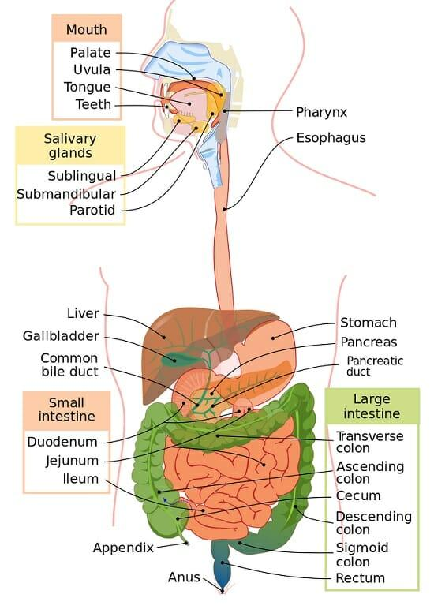
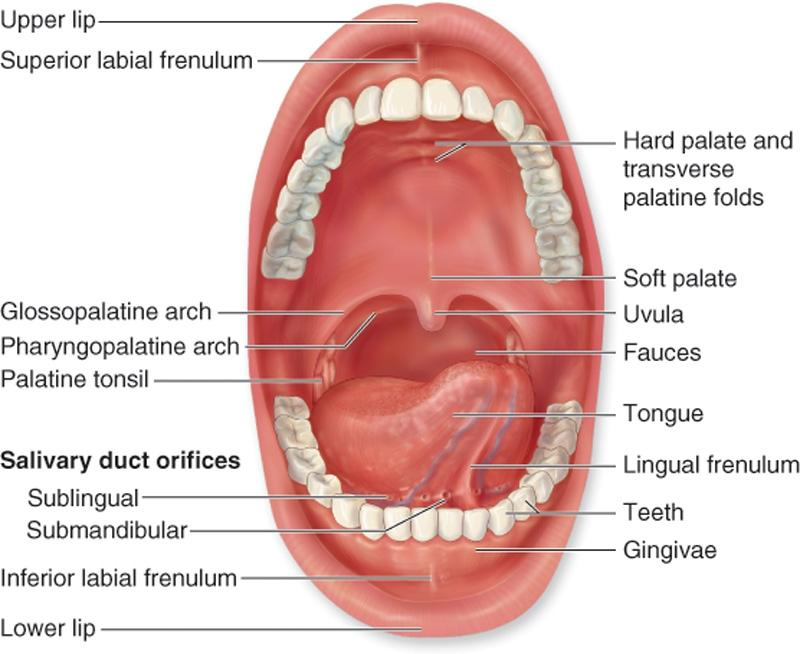
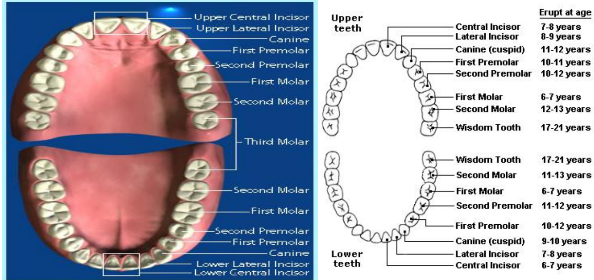

# 第七章 消化系统（Digestive System）

## 黑体词
glucose,triglycerides,amino acid,alimentary canal,gastrointestinal(GI) tract,accessory digestive organs,mouth,pharynx,esophagus,stomach, small and large intestines,colonrectum,anus,salivary glands,gallbladder,liver,pancreas,teeth,tongue,saliva,Taste buds,palate,uvula,gag reflex,cuspids,canines,bicuspids,premolars,molars,crown,root,enamel,dentin,deciduous teeth,permanent teeth,oropharynx,laryngopharynx,epiglottis,peristalsis,cardiac region,fundus,body,pyloric region,rugae,chyme,sphincters,muscle tone,The duodenum,The jejunum,The ileum,ileocecal valve,small intestine,Villi,small intestine,bowel movements,cecum,ascending colon,transverse colon,descending colon,sigmoid colon,rectum,salivary glands,liver,pancreas,gallbladder,salivary glands,saliva,bolus,amylase,parotid glands,submandibular glands,sublingual glands,falciform ligament,common hepatic duct,bile duct,Emulsification,cystic duct,gallbladder,gallstones,jaundice,pancreas

## 一、总览（Anatomy & Physiology of the Digestive System）

* **三大功能**：①消化（digestion：机械+化学）②吸收（absorption）③排泄/排出（elimination）。

  * **机械性消化**：把大块食物**物理性**变小，不改变化学成分。
  * **化学性消化**：把食物分解为**更简单的营养分子**（glucose、triglycerides、amino acids），再被肠道**吸收**，经**心血管系统**运输供机体生长修复；不能被消化/吸收者转为**粪便**排出。
* **器官分组**

  * **消化道/胃肠道（alimentary canal / GI tract）**：口（mouth/ oral cavity）、咽（pharynx：口咽oropharynx、喉咽laryngopharynx）、食管（esophagus）、胃（stomach）、小肠（small intestine：十二指肠duodenum、空肠jejunum、回肠ileum）、大肠/结肠（colon：盲肠cecum+阑尾appendix、升结肠ascending、横结肠transverse、降结肠descending、乙状结肠sigmoid）、直肠rectum、肛门anus。

    * 长度提示：**尸体约9 m**；生前因肌张力**更短**。
  * **附属消化器官（accessory organs）**：**唾液腺**（腮腺parotid、下颌下腺submandibular、舌下腺sublingual）、**肝**（liver）、**胆囊**（gallbladder）、**胰腺**（pancreas）。均以**导管**与消化道相连，把分泌物排入肠道。

> 图示：Fig.7.1 消化系统解剖总览

## 二、口腔与牙（Oral cavity & Teeth）

* **口腔结构与功能**

  * **牙**机械性咀嚼；**舌**（taste buds 味蕾：苦/甜/酸/咸）搅拌并与**唾液**混合；唾液含**淀粉酶 amylase**（分解碳水）与**润滑成分**（利吞咽），与食物形成**食团 bolus**。
  * **腭（palate）**：**硬腭**（前部骨性）+**软腭**（后部柔软）；软腭后缘悬有**悬雍垂 uvula**：参与**发音**与**呕吐反射（gag reflex）**，防误吸。
  * 口腔壁：**颊**为侧壁，**唇**为前开口；整体由**黏膜**覆盖。
  * **会厌 epiglottis**：吞咽时**覆盖喉与气管**，使食物进入食管。
* **牙齿类型与结构**

  * **前牙切割**：**切牙 incisors**、**犬齿 cuspids/canines**。
  * **后牙研磨**：**前磨牙 bicuspids/premolars**、**磨牙 molars**。
  * **分区**：**牙冠 crown**（龈线上方）＋**牙根 root**（龈线下，固定于颌骨）。

    * 牙冠外覆**牙釉质 enamel**（全身最硬）；其下为**牙本质 dentin**（主体）；中空为**牙髓腔 pulp cavity/根管 root canal**，内含血管、神经、淋巴管。
* **两套牙**

  * **乳牙 deciduous teeth**：**20 颗**，**6–28 个月**萌出；约**6 岁**起脱落，由**恒牙 permanent teeth 32 颗**替代，**18–20 岁**完成替换。

> 图示：Fig.7.2 口腔解剖

> 图示：Fig.7.3 乳牙/恒牙

## 三、上消化道（Pharynx, Esophagus, Stomach）

* **咽（Pharynx）**：食物经**口咽→喉咽**；**会厌**防误入下呼吸道。
* **食管（Esophagus）**：成人约**10 英寸**；**蠕动 peristalsis**推进食团贯穿整个消化道。
* **胃（Stomach）**

  * **部位**：左上腹，受**肝、膈**遮挡；**J 形**肌性囊袋，负责**容纳、搅拌、消化、暂存**。
  * **四区**：

    1. **贲门区 cardiac region**（食管入胃处）；
    2. **胃底 fundus**（上外侧膨大部）；
    3. **胃体 body**（中部主干）；
    4. **幽门区 pyloric region**＝幽门窦 antrum + 幽门管 canal + **幽门部/括约肌 pyloric sphincter**（通小肠）。
  * **皱襞 rugae**：胃充盈时**被拉平**。
  * **化学消化**：胃黏膜腺分泌**盐酸 HCl**与**胃液**，食物混合成**食糜 chyme**。
  * **括约肌**：

    * **贲门/下食管括约肌（cardiac/LES）**防止食物**反流**至食管；
    * **幽门括约肌**间歇开放：①小肠腔径较细；②食糜**强酸性**，需在入肠后**充分中和**。

> 图示：Fig.7.4–7.5 胃部解剖

## 四、小肠（Small Intestine）与绒毛（Villi）

* **长度**：尸体约**6–7 m（20 ft）**；生前因肌张力约**2 m**。
* **三段**：

  1. **十二指肠 duodenum**（约**25 cm/10 in**，围胰头）——与**胰液、胆汁**混合，**完成消化**；
  2. **空肠 jejunum**（约**2.5 m/8 ft**）——**大多数营养吸收**；
  3. **回肠 ileum**（约**3.6 m/12 ft**）——末端经**回盲瓣 ileocecal valve**入结肠；**末端特异吸收**：**维生素B12**、**胆盐**；**十二指肠吸铁（Fe）**。
* **小肠绒毛（villi）**：黏膜指状突出，**扩大吸收面积**；小肠为**主要消化与吸收部位**，异常可致**营养不良**。

> 图示：Fig.7.6 小肠；Fig.7.7 绒毛

## 五、结肠/大肠（Colon / Large Intestine）

* **功能**：小肠完成营养吸收后，残余液体（主要是**水**）进入结肠，**重吸收水分**；剩余形成**粪便 feces**，储于**直肠**，经**肛门括约肌**控制排出。
* **解剖**：**盲肠 cecum**（近端2–3 in，连**阑尾**）、**升结肠→横结肠→降结肠→乙状结肠→直肠→肛门**。

> 图示：Fig.7.8 结肠结构

## 六、附属消化器官（Accessory Organs）

### 1) 唾液腺（Salivary glands）

* 受食物/机械刺激（甚至咀嚼橡皮筋/蜡）分泌**唾液**→润滑吞咽、含**淀粉酶 amylase**（起始碳水化合物消化）；与食物形成**食团 bolus**。
* **三对**：**腮腺（parotid）**、**下颌下腺（submandibular）**、**舌下腺（sublingual）**。

### 2) 肝与胆囊（Liver & Gallbladder）

* **肝**：**最大腺体**，位于膈下、偏右；**四叶**，以**镰状韧带 falciform ligament**悬吊。**消化功能**＝**产生胆汁**（经**肝总管→胆总管→十二指肠**）。胆汁**不含酶**，其作用是**乳化脂肪（emulsification）**。
* **胆囊**：非进食期，胆汁经**胆囊管 cystic duct**倒流入**胆囊**储存并**浓缩**（去水及部分离子）；脂肪餐入十二指肠→激素信号促**胆囊收缩**，释放胆汁。
* **临床要点**：

  * 胆汁**胆固醇过多**等可致**胆结石 gallstones**；女性更常见，**肥胖**↑风险。
  * **肝总管/胆总管阻塞**→胆汁不入肠而**回流入肝与血**→**黄疸 jaundice**（阻塞性黄疸）。
  * **非阻塞性**常见于**肝炎/hepatitis、肝硬化/cirrhosis**。
  * **营养代谢**：首过处理；**葡萄糖→糖原**储存；摄取氨基酸合成**血浆蛋白**等。

> 图示：Fig.7.8 胆道系统

### 3) 胰腺（Pancreas）

* **外分泌**：产生**水解酶**与**强碱性胰液**（经胰管入十二指肠）→**中和胃酸性食糜**，使胰/肠酶在**最适 pH**下工作。
* **内分泌**：分泌**胰岛素 insulin**与**胰高血糖素 glucagon**调控**血糖**。

## 七、医学构词：**消化系统常见词根/结合形式**（Combining forms）

> 记忆法：**器官部位/物质 + 后缀（炎/切除/镜检/造口等）**
> （下表含“原文给出的示例词”）

| 结合形式             | 含义      | 示例                |
| -------------------- | --------- | ------------------- |
| an/o                 | 肛门      | **anal**            |
| append/o, appendic/o | 阑尾      | **appendectomy**    |
| bucc/o               | 颊        | **buccolabial**     |
| cec/o                | 盲肠      | **ileocecal**       |
| cheil/o, labi/o      | 唇        | **cheilorrhaphy**   |
| chol/e               | 胆汁      | **cholelithiasis**  |
| cholangi/o           | 胆管      | **cholangiotomy**   |
| cholecyst/o          | 胆囊      | **cholecystogram**  |
| choledoch/o          | 总胆管    | **choledochectomy** |
| col/o, colon/o       | 结肠      | **colectomy**       |
| dent/o, odont/o      | 牙        | **orthodontics**    |
| enter/o              | 小肠      | **enteritis**       |
| gastr/o              | 胃        | **gastrodynia**     |
| gingiv/o             | 龈        | **gingivectomy**    |
| gloss/o              | 舌        | **hypoglossal**     |
| hepat/o              | 肝        | **hepatitis**       |
| lapar/o              | 腹        | **laparotomy**      |
| lingu/o              | 舌        | **sublingual**      |
| lith/o               | 结石      | **lithotripsy**     |
| or/o                 | 口        | **oropharynx**      |
| palat/o              | 腭        | **palatine**        |
| pancreat/o           | 胰        | **pancreatitis**    |
| pharyng/o            | 咽        | **pharyngodynia**   |
| proct/o              | 直肠/肛门 | **proctoptosis**    |
| rect/o               | 直肠      | **rectalgia**       |
| sial/o               | 唾液腺    | **sialolith**       |
| stomat/o             | 口        | **stomatology**     |

**常见后缀（Suffixes）**

* **-emesis**（呕吐）→ *hematemesis* 吐血
* **-lithiasis**（结石病）→ *cholelithiasis* 胆结石
* **-orexia**（食欲）→ *anorexia* 食欲缺乏
* **-ostomy**（造口）→ *colostomy* 结肠造口
* **-pepsia**（消化）→ *dyspepsia* 消化不良
* **-phagia**（吞咽/进食）→ *polyphagia* 多食
* **-prandial**（与进餐相关）→ *postprandial* 餐后
* **-tripsy**（碎石/压碎术）→ *lithotripsy* 碎石术

## 八、常用诊断检查（Digestive Diagnostics）

* **腹部超声 Abdominal ultrasonography**：超声成像腹部脏器。
* **钡灌肠 Barium enema / Lower GI series**：钡剂经肛灌注显影**结肠/小肠**X线检查。
* **钡餐/上消化道造影 Barium swallow / Upper GI series**：钡剂口服显影**食管、胃、十二指肠**X线。
* **胃镜 Gastroscopy（EGD）**：经口入镜观察**食管-胃-十二指肠**；可**活检**。
* **肝穿刺活检 Liver biopsy**：取肝组织做病理。
* **粪便培养 Stool culture**：找**致病菌**。

## 九、常见疾病

### 1) **胃癌（Gastric cancer）**

* **流行**：全球高发；**男性**多；每年高死亡率。
* **危险因素**：**H. pylori**（约≥80%相关）、**高盐饮食**、**吸烟**、**蔬果摄入低**、**慢性胃炎/肠上皮化生**、**遗传（约10%）**；**雌激素**可能有保护作用。
* **症状**

  * **早期**：常**无症状**或**非特异**（消化不良、烧心、食欲减退（尤其对肉类））；
  * **晚期**：上腹痛、恶心呕吐、腹泻/便秘、餐后腹胀、**体重下降**、乏力、**消化道出血**（呕血/黑便→贫血）、**吞咽困难**提示贲门/食管受累。
* **诊断**：

  * **首选**：**胃镜+活检**（唯一确诊）；
  * **上消化道造影**、**腹部CT**（侵袭/淋巴结/分期评估）。
* **治疗**：个体化；**手术**为主（部分/全胃切±周围组织，早癌可**EMR/ESD**）；**化疗/放疗**（围手术期或姑息）；研究中方案如**腹腔热灌注**等。

### 2) **消化性溃疡（Peptic Ulcer Disease, PUD）**

* **定义**：酸性环境中消化道\*\*≥0.5 cm 黏膜糜烂/溃疡\*\*；部位：**胃**、**十二指肠**、**食管**。

  * **胃溃疡约4%为恶性**，故需**多点活检**；**十二指肠溃疡多为良性**。
* **病因**：**H. pylori（\~80%）**；**NSAIDs**（阿司匹林等）；少数与肿瘤相关。
* **分型（部位）**：I 小弯；II 胃+十二指肠双发；III 幽门前；IV 近贲门；V 胃体部任何处（NSAID相关）。
* **症状学规律**（临床并不绝对）：

  * **十二指肠溃疡**：多在**餐前/饥饿**时痛，**进食可缓解**；
  * **胃溃疡**：**餐中/餐后**痛（胃酸分泌/十二指肠碱性内容物反流刺激）。
  * 伴胀满、水样涎（waterbrash）、恶心呕吐、食欲减退/体重下降、**呕血/黑便**。
* **并发症**：**出血**（最常见，可危及生命）、**穿孔**（前壁→化学/细菌性腹膜炎；后壁→胰腺炎，痛放射背部）、**穿透**邻器官、**瘢痕狭窄/幽门梗阻**、**幽门狭窄**等。
* **压力与溃疡**：心理应激与H. pylori感染、胃酸分泌可能协同，**并非纯感染病**。
* **诊断**：**胃镜（EGD）**定位评估；**H. pylori**检测：**尿素呼气试验**、活检**培养/快速尿素酶**、**血清抗体**（是否据此直接根除有争议）、**粪抗原**、**病理染色**。
* **治疗**：

  * 年轻疑似患者可先**抗酸药/H2RA**；**铋剂**可降低菌负荷。
  * **NSAID相关**：合并**米索前列醇**预防。
  * **根除 H. pylori**：**双抗生素 + PPI**（如*Clarithromycin/Amoxicillin/Metronidazole/Tetracycline*任选两种+**PPI**；难治可三联抗）。举例：**Amoxicillin + Metronidazole + Rabeprazole**。
  * **非幽门螺**：多用**长期较大剂量PPI**。
  * **并发症处理**：穿孔需**急诊手术**；活动性出血多需**紧急内镜止血**（电凝/注射）。
  * PPI广泛应用后，传统单纯溃疡外科（如高选择性迷走神经切断）已**罕用**。

## 十、练习与病例（考试导向速记）

* **练习 I—III 的本质**：考**构词法**（词根/后缀）→能迅速写出**炎（-itis）**、**切除（-ectomy）**、**镜检（-scopy）**、**造口（-ostomy）**、**缝合（-rrhaphy）**、**肿瘤（-oma）**、**增大（-megaly）**、\*\*切开（-tomy）\*\*等术语。

  * 例：*gastritis, gastroenterology, gastrectomy, gastroscopy, gastrorrhaphy, gastromegaly, gastrotomy...*（课件已给出标准答案清单，复习时对照背诵即可。）
* **病例（56 岁男性，上腹/左上腹痛+贫血）要点**

  * **提示**：慢性**消化不良**史；症状加重伴**恶心/呕吐**；**CBC 贫血**、**粪潜血阳性**、**H. pylori阳性**；UGI 显影见**胃黏膜糜烂**；胃镜见**返流性食管炎**与**幽门部溃疡（1.5 cm，活动性出血）**；**多点活检排除胃癌**；\*\*静脉H2RA（Tagamet/西咪替丁同类）\*\*缓解症状。
  * **诊断**：**消化性溃疡**。
  * **处理建议**：**出血性溃疡**→考虑**胃切除**（切除溃疡段）、**继续抑酸**、\*\*抗生素（如Keflex）\*\*治疗感染、**补铁**纠正贫血、**少量多餐**、**避免酒精与刺激食物**。
  * \*\*LUQ（Left Upper Quadrant）\*\*所含器官（按课件列举）：胃、脾、肾、胰体、部分肝、肾上腺、结肠脾曲、**胆囊**、部分十二指肠。

    * **解剖学提醒**：标准解剖定位中**胆囊通常位于右上腹（RUQ）**；课件此处将胆囊列入LUQ，**考试以授课教师口径为准**，同时牢记**常规定位是RUQ**，避免混淆。

## 十一、易混/高频考点速记

* **吸收分段特异性**：**十二指肠吸铁（Fe）**；**空肠吸大多数营养**；**末端回肠吸B12与胆盐**。
* **括约肌**：**LES 防反流**；**幽门括约肌**控制**酸性食糜**入肠速率（为**小肠腔细+中和需要**）。
* **胆道淤积→黄疸**：记住**阻塞**与**肝细胞性**的区分。
* **PUD并发症四大类**：**出血、穿孔、穿透、梗阻/狭窄**。
* **胃癌确诊**：**胃镜+活检**；**上消化道造影**不替代病理。
* **术语**：-itis（炎）、-ectomy（切除）、-otomy（切开）、-ostomy（造口）、-scopy（镜检）、-rrhaphy（缝合）、-megaly（增大）、-algia/-dynia（痛）、-oma（肿瘤）等。

## 十二、重点英文单词（精选高频）

> 建议优先掌握下列**高频核心**；其余详见下一节“完整词表整合”。

**解剖/结构**：
oral cavity 口腔｜palate 腭（hard/soft）｜uvula 悬雍垂｜tongue 舌｜taste bud 味蕾
pharynx 咽（oropharynx/ laryngopharynx）｜epiglottis 会厌｜esophagus 食管
stomach 胃（cardiac region/fundus/body/pyloric region）｜rugae 胃皱襞｜sphincter 括约肌
small intestine 小肠（duodenum/jejunum/ileum；ileocecal valve）｜villi 绒毛
large intestine/colon 大肠/结肠（cecum/appendix/ascending/transverse/descending/sigmoid）
rectum 直肠｜anus 肛门｜salivary gland 唾液腺（parotid/submandibular/sublingual）
liver 肝｜gallbladder 胆囊｜bile 胆汁｜pancreas 胰腺

**功能/过程**：
mechanical/chemical digestion 机械/化学消化｜absorption 吸收｜elimination 排泄
bolus 食团｜chyme 食糜｜peristalsis 蠕动｜emulsification 乳化

**疾病/症状**：
gastric cancer 胃癌｜peptic ulcer disease（PUD）消化性溃疡
heartburn 烧心｜dysphagia 吞咽困难｜hematemesis 吐血｜melena 黑便｜jaundice 黄疸

**检查/治疗**：
gastroscopy 胃镜（EGD）｜upper/lower GI series 上/下消化道造影（barium swallow/enema）
abdominal ultrasonography 腹部超声｜liver biopsy 肝穿｜stool culture 粪培养
EMR/ESD 黏膜切除/黏膜下剥离术｜chemotherapy 化疗｜radiation therapy 放疗

## 十三、完整“Word List”整合（按课件原表）

alimentary 食物的；amino acid 氨基酸；bicuspid 前磨牙；canine 犬齿；cardiac region 贲门区；chyme 食糜；cuspid 犬牙；cystic duct 胆囊管；deciduous teeth 乳牙；dentin 牙本质；duodenum 十二指肠；emulsification 乳化；enamel 牙釉质；epiglottis 会厌；esophagus 食管；falciform ligament 镰状韧带；fundus 胃底；gag reflex 作呕反射；gallbladder 胆囊；glucose 葡萄糖；ileocecal 回盲的；ileum 回肠；incisor 切牙；jaundice 黄疸；jejunum 空肠；laryngopharynx 喉咽；molar 磨牙；oropharynx 口咽；parotid glands 腮腺；peristalsis 蠕动；permanent teeth 恒牙；premolar 前磨牙；pulp cavity 牙髓腔；pyloric region 幽门部；rectum 直肠；root canal 牙根管；ruga 褶皱；salivary gland 唾液腺；sublingual gland 舌下腺；submandibular gland 下颌下腺；triglycerides 甘油三酯；uvula 小舌/悬雍垂。

