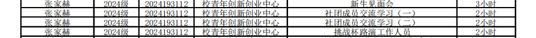
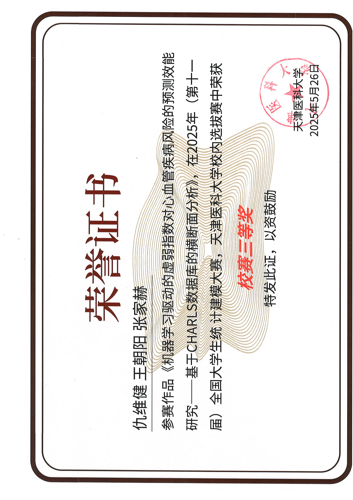

# 综测证据材料清单
## 综合拓展

| 序号 |    日期    | 活动名称/主题                           | 学时 | 证明来源（班级日志/团委签到/学工部时长/公示等） |
| ---: | :--------: | :-------------------------------------- | :--: | :---------------------------------------------- |
|    1 |     -      | 2025十佳歌手决赛暨第三届草坪音乐会      |  10  | 第一临床医学院活动统计汇总表（团委盖章）        |
|    2 |     -      | 文化活动日                              |   3  | 第一临床医学院活动统计汇总表（团委盖章）        |
|    3 |     -      | 文化活动日                              |   3  | 第一临床医学院活动统计汇总表（团委盖章）        |
|    4 |     -      | "明辨杯"辩论赛                          |   6  | 第一临床医学院活动统计汇总表（团委盖章）        |
|    5 |     -      | 社团活动                                |   2  | 第一临床医学院活动统计汇总表（团委盖章）        |
|    6 |     -      | 社团活动                                |   2  | 第一临床医学院活动统计汇总表（团委盖章）        |
|    7 |     -      | 社团活动                                |   2  | 第一临床医学院活动统计汇总表（团委盖章）        |
|    8 |     -      | 社团活动                                |   2  | 第一临床医学院活动统计汇总表（团委盖章）        |
|    9 |     -      | 社团活动                                |   2  | 第一临床医学院活动统计汇总表（团委盖章）        |
|   10 |     -      | 社团活动                                |   2  | 第一临床医学院活动统计汇总表（团委盖章）        |
|   11 |     -      | 社团活动                                |   2  | 第一临床医学院活动统计汇总表（团委盖章）        |
|   12 |     -      | 社团活动                                |   2  | 第一临床医学院活动统计汇总表（团委盖章）        |
|   13 |     -      | 社团活动                                |   2  | 第一临床医学院活动统计汇总表（团委盖章）        |
|   14 |     -      | 社团活动                                |   2  | 第一临床医学院活动统计汇总表（团委盖章）        |
|   15 |     -      | 社团活动                                |   2  | 第一临床医学院活动统计汇总表（团委盖章）        |
|   16 |     -      | 社团活动                                |   2  | 第一临床医学院活动统计汇总表（团委盖章）        |
|   17 |     -      | 社团活动                                |   2  | 第一临床医学院活动统计汇总表（团委盖章）        |
|   18 |     -      | 社团活动                                |   2  | 第一临床医学院活动统计汇总表（团委盖章）        |
|   19 |     -      | 社团活动                                |   2  | 第一临床医学院活动统计汇总表（团委盖章）        |
|   20 |     -      | 新生见面会                              |   3  | 第一临床医学院活动统计汇总表（团委盖章）        |
|   21 |     -      | 社团成员交流学习（一）                  |   2  | 第一临床医学院活动统计汇总表（团委盖章）        |
|   22 |     -      | 社团成员交流学习（二）                  |   2  | 第一临床医学院活动统计汇总表（团委盖章）        |
|   23 |     -      | 挑战杯路演工作人员                      |   2  | 第一临床医学院活动统计汇总表（团委盖章）        |
|   24 | 2025-06-04 | 讲座                                    |   2  | 儿科班大一日志                                  |
|   25 | 2025-09-28 | 迎新晚会                                |   4  | 儿科班大一日志                                  |
|   26 | 2025-10-23 | 足球比赛                                |   1  | 儿科班大一日志                                  |
|   27 | 2025-10-30 | 辩论赛                                  |   1  | 儿科班大一日志                                  |
|   28 | 2025-11-20 | 辩论赛第一场                            |   1  | 儿科班大一日志                                  |
|   29 | 2025-11-27 | 辩论                                    |   1  | 儿科班大一日志                                  |
|   30 | 2025-11-27 | 分享会                                  |   1  | 儿科班大一日志                                  |
|   31 | 2025-11-28 | 医路讲座                                |   1  | 儿科班大一日志                                  |

## 荣誉类

### 文化、艺术、体育类获奖（院系级）

**1. 2024-2025学年第一临床医学院辩论赛荣获一等奖**
- 级别：院级一等奖
- 分值：0.5分
- 证据材料：

    

**2. 2025年生物医学院电赛暨TI杯全国大学生电子设计大赛选拔赛**
- 获奖等级：一等奖
- 级别：院系级
- 分值：0.5分
- 证据材料：

    

### 集体荣誉称号类（综合类）

**1. 2024-2025学年度天津医科大学优秀学生组织及学院学生会名单**
- 组织：校青年创新创业中心
- 身份：成员
- 级别：学校级
- 分值：1.0分
- 证据材料：

## 创新意识

| 序号 | 观测点                                    | 项目名称/类型                                                | 分值 | 佐证                   |
| ---: | :---------------------------------------- | :----------------------------------------------------------- | ---: | :--------------------- |
|    1 | 参加专业讲座、学术报告、学术沙龙、学术论坛等 | 医路讲座                                                   | 1.5  | 儿科班大一日志         |
|    2 | 参与科技小发明竞赛、创新创意竞赛、创业计划竞赛 | 大创立项                                                   | 1.5  | 立项通知（教务盖章）   |
|    3 | 参与学科竞赛、技能竞赛                   | 全国大学生统计建模大赛                                     | 1.5  | 荣誉证书               |

## 创新成果

### 学术科研类

**1. 国家级大学生创新创业训练计划项目立项**
- 项目："大模型赋能：数字孪生与注意力机制融合下的糖尿病并发症智能防控体系构建"
- 身份：参与者（团队成员）
- 级别：国家级（立项）
- 分值：0.9分（3.0×30%）
- 证据材料：

    

### 创新创业类

**1. 2025年中国国际大学生创新大赛（天津医科大学赛区）高教主赛道获奖**
- 项目："智能交互式睡眠眼罩——亚健康时代下可穿戴设备引领者"
- 身份：参与者（团队成员）
- 获奖等级：铜奖
- 级别：学校级
- 分值：1.5分
- 证据材料：

### 实践创新类

**1. 2025年天津医科大学大学生社会实践创新项目（TMUSPIP）立项**
- 项目："重走金沽红色路·青春接力赤子心"——爱国主义实践团
- 身份：参与者
- 级别：院系级（立项）
- 分值：0.15分（0.5×30%）
- 证据材料：

    

### 学科竞赛类

**1. 2025年（第十一届）全国大学生统计建模大赛天津医科大学校内选拔赛**
- 作品："机器学习驱动的虚弱指数对心血管疾病风险的预测效能研究——基于CHARLS数据库的横断面分析"
- 获奖等级：三等奖
- 级别：学校级
- 分值：0.8分
- 证据材料：
  

    

**2. 华北五省（市、自治区）大学生机器人大赛天津赛区**
- 作品："机器人书画赛"
- 获奖等级：三等奖
- 级别：省市级
- 分值：1.5分
- 证据材料：

    

