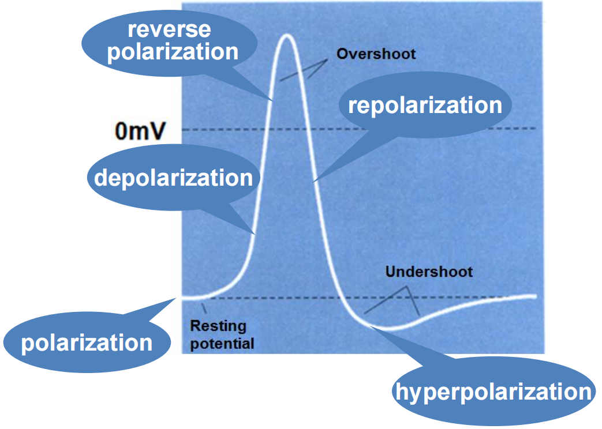

# 细胞的电现象（精要笔记 + 重点英文术语）

> 适用于考点复习与课堂回顾；覆盖定义-机制-公式-数值-实验与临床联系。

---

## 一、生物电现象概述（Bioelectricity）

* **定义**：活细胞在静息与活动状态下产生的电活动统称**生物电现象**。
* **临床应用**：心电图 **ECG**、脑电图 **EEG**、肌电图 **EMG/ENG**（课件作 *ENG* 标注）、视网膜电图 **ERG**。
* **核心量**：**跨膜电位**（膜电位，Transmembrane/Membrane potential）。

---

## 二、静息电位 RP（Resting Potential）

### 1) 定义与特征

* 未受刺激时，细胞内相对外**为负**的稳定电位差；**内负外正**、**跨膜**、**相对稳定**。
* **典型数值范围**：**−10～−100 mV**；骨骼肌 −90 mV，神经元 −70 mV，平滑肌 −55 mV，红细胞 −9 mV。

### 2) 极化相关术语

* **极化**（polarization）：内负外正的静息状态。
* **去极化**（depolarization）：膜电位**变得不那么负**。
* **超极化**（hyperpolarization）：膜电位**比静息更负**。
* **反极化**/**超射**（reverse polarization/overshoot）：内正外负。
* **复极化**（repolarization）：去极后**回到**静息水平的过程。

### 3) 形成机制（“K⁺主导 + 少量Na⁺ + Na⁺/K⁺泵”）

* **K⁺梯度不均** + 静息时膜**对K⁺通透性高** → **细胞内K⁺浓度高** + **K⁺电场力阻碍外流** → **接近K⁺平衡电位**（E\_K）。
* **少量Na⁺漏入**（Na⁺通透性虽小但非零）使RP**略小于**理论E\_K。
* **Na⁺/K⁺泵**（3Na⁺出/2K⁺入）维持离子梯度、对RP有弱超极化贡献。
* **Nernst 方程**（单离子平衡电位）：

  $$
  E_x = \frac{RT}{zF}\ln\frac{[X]_o}{[X]_i}
  $$

  静息近似 $RP \approx E_K$。
* **影响因素**：
  ① **\[K⁺]\_o↑ → RP减小（去极化）**；
  ② **通透性**：P\_K↑ → RP更负；P\_Na↑ → RP减小；
  ③ **Na⁺/K⁺泵活性**：增强→RP略更负。

---

## 三、动作电位 AP（Action Potential）

### 1) 组成与相位

* **锋电位**（Spike）：

  * **去极相**：快速上升至0并**超射**至+30 mV左右（接近 E\_Na）。
  * **复极相**：回落至静息。
* **后电位**（After-potential）：

  * **负后电位 ADP**（after-depolarization）：短暂去极偏移；
  * **正后电位 AHP**（after-hyperpolarization）：短暂更负，常与泵活性/K⁺外积累相关。

### 2) 关键特性

* **全或无**（all-or-none）；
* **不衰减传导**（unattenuated conduction）；
* **冲动不融合**（频率编码，存在**不应期**）。

### 3) 产生机制（Hodgkin-Huxley 模型要点）

* **触发阈电位 TP**：比RP**小10～20 mV**（不那么负）时爆发AP。
* **Na⁺再生性正反馈**：少量电压门控**Na⁺通道**先开 → 去极 → **更多Na⁺通道开** → 快速去极至接近 **E\_Na（约+60 mV）**。
* **复极化**：Na⁺通道**失活**，电压门控**K⁺通道打开** → K⁺外流↑ → 膜电位回落；随后可能出现AHP。
* **膜电导变化**：先 **G\_Na↑（且快速衰减）**，继而 **G\_K↑** 加速复极。

### 4) 离子驱动力与电压钳/膜片钳

* **电化学驱动力**：$\text{Driving force} = E_m - E_x$（内向<0，外向>0）。
* **电压钳**：钳定膜电位测膜电流 → 解析 **G\_Na/G\_K** 的电压与时间依赖。
* **膜片钳**：记录**单通道**电流（pA级），求 **I = i·P\_o·N**（宏电流与单通道统计的关系），确证**离子通道“开放/关闭”门控**本质与 m/h/n 门控变量概念。

### 5) 阈电位与兴奋性

* **阈电位（TP）**：到达即能引发AP的临界电位。
* **影响TP/兴奋性**：
  ① **电压门控Na⁺通道密度↑ → TP下移（更易兴奋）**；
  ② **细胞外Ca²⁺↓ → Na⁺通道更易开 → TP下移 → 兴奋性↑**（低钙抽搐）。
* **兴奋性 \~ 1/阈值**（阈值↓则兴奋性↑）。

---

## 四、动作电位的传导与传播

* **传导（Conduction）**：同一细胞膜上靠**局部电流**向前激活。
* **跳跃式传导（Saltatory conduction）**：有髓纤维在**郎飞结**间跳跃，快且省能。
* **细胞间传播（Transmit）**：如**缝隙连接（Gap junction）**，低阻水通道（2–4 nm），可实现电耦联与同步化。

---

## 五、不应期与兴奋性周期变化

* **绝对不应期 ARP**：**Na⁺通道失活**，再强刺激也不能触发AP。
* **相对不应期 RRP**：部分Na⁺通道复活，需**超阈刺激**。
* **超常期 SNP**：兴奋性**短暂高于**正常（更易被引发，常在ADP后段）。
* **低常期**：兴奋性**低于**正常（常与AHP对应）。
* 影响因素：**Na⁺通道状态**、**RP-TP差值**、**\[Ca²⁺]o** 等。

---

## 六、局部电位 LP 与电紧张电位

### 1) 电紧张电位（Electrotonic potential）

* **无通道激活**、**无电导改变**的被动电位变化（膜视作RC电路：**C\_m、R\_m、R\_i**）。

### 2) 局部电位（Local potential, LP）

* **亚阈刺激**开少量Na⁺通道 → **局部去极**但未达TP。
* **性质**：
  ① **非全或无（渐变性）**；
  ② **电紧张性扩布/衰减式传导**；
  ③ **无不应期**；
  ④ **可总和**（时间/空间）。
* **作用**：提高兴奋性；**多次总和达TP**时引发AP。
* **极性效应**：负极（外向刺激电流）→ 去极；正极（内向刺激电流）→ 超极化（去/超极化幅度呈不对称性）。

---

## 七、经典实验与里程碑

* **Bernstein 膜学说**：RP由**K⁺平衡电位**决定、静息以K⁺通透为主。
* **J.Z. Young**：发现**乌贼巨轴突**（便于电生理研究）。
* **Hodgkin-Huxley**：首次**精确测量RP/AP**并建模，提出**离子通道**与**G\_Na/G\_K**时空变化；电压钳技术发展做出关键贡献。
* **膜片钳（Neher & Sakmann）**：确证**单通道**功能特性（诺奖 1991）。
* **通道结构（R. MacKinnon）**与**水通道（P. Agre）**：揭示离子/水通道结构-机制（诺奖 2003）。

---

## 八、与临床/生理问题的联系（融会贯通）

* **轻度高钾血症**：**\[K⁺]o↑ → RP减小（去极化）** → **AP幅度与传导速度下降**；重度时Na⁺通道持续失活，**心搏骤停**可发生。
* **低钙血症**：**\[Ca²⁺]o↓ → TP下移 → 兴奋性↑** → **手足搐搦/抽搐**。
* **高阈值/低兴奋性**：如Na⁺通道密度低、RP与TP差增大 → 更难触发AP。

---

## 九、常用公式与重要数值

* **Nernst 方程**：$E_x=\frac{RT}{zF}\ln\frac{[X]_o}{[X]_i}$（单离子平衡电位）。
* **离子驱动力**：$E_m - E_x$；阴/阳性判断方向（内向/外向）。
* **宏电流**：$I = i\cdot P_o\cdot N$（单通道电流 × 开放概率 × 通道数）。
* **典型平衡电位**：$E_{Na}\approx +60\,\text{mV}$，$E_{K}\approx -90\,\text{mV}$。
* **阈电位**：约比RP**小10–20 mV**。

---

## 十、重点英文术语（中英对照，按知识块分组）

**基础与临床**

* 生物电现象：**bioelectricity**
* 膜/跨膜电位：**membrane (transmembrane) potential**
* 心/脑/肌/视网膜电图：**ECG / EEG / EMG(ENG) / ERG**

**静息电位与极化**

* 静息电位：**resting potential (RP)**
* 极化/去极化/复极化/超极化/反极化（超射）：**polarization / depolarization / repolarization / hyperpolarization / reverse polarization (overshoot)**

**动作电位与阈值**

* 动作电位：**action potential (AP)**
* 锋电位/后电位：**spike / after-potential**（**ADP / AHP**）
* 阈电位/阈刺激：**threshold potential / threshold stimulus**
* 全或无：**all-or-none principle**
* 不应期：**refractory period**（**absolute / relative / supernormal / subnormal**）
* 兴奋性：**excitability**

**离子学与通道**

* 平衡电位：**equilibrium potential**
* Nernst 方程：**Nernst equation**
* 内向/外向电流：**inward / outward current**
* 膜电导/电阻/电容：**membrane conductance (G) / resistance (R\_m) / capacitance (C\_m)**
* 轴向电阻：**axial resistance (R\_i)**
* 电压门控通道：**voltage-gated ion channel**（**activation/inactivation gate；m/h/n gate**）
* Na⁺/K⁺泵：**Na⁺-K⁺ pump**
* 漏通道：**leak channel**

**技术与模型**

* 玻璃微电极：**glass microelectrode**
* 电压钳：**voltage clamp**
* 膜片钳/千兆封接：**patch clamp / giga-seal**
* 单通道电流与宏电流：**single-channel current / macroscopic current**
* 跳跃式传导：**saltatory conduction**
* 缝隙连接：**gap junction**

**传导与总和**

* 电紧张电位：**electrotonic potential**
* 局部电位：**local potential (LP)**
* 电紧张性扩布（衰减式传导）：**electrotonic propagation (decremental conduction)**
* 时间/空间总和：**temporal / spatial summation**

---

## 十一、易考点速记

* **RP≈E\_K**（但略小于 |E\_K|，因少量Na⁺漏入 + 泵）。
* **AP去极=Na⁺通道快开与再生性正反馈；复极=Na⁺失活 + K⁺通道开。**
* **\[K⁺]o↑ → 去极化（RP减小）；\[Ca²⁺]o↓ → TP下移 → 兴奋性↑。**
* **LP可总和、可衰减、无不应期；AP全或无、不衰减、有不应期。**

