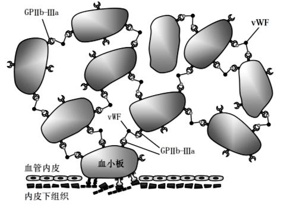

# 血液生理学

---

## 一、血液的功能（Functions of blood）

* **运输（Transport）**：气体、营养物质、代谢产物、激素等（transport of gases/nutrients/metabolites/hormones）
* **缓冲（Buffer function）**：维持酸碱平衡（acid-base homeostasis）
* **恒温（To keep body temperature relatively constant）**：热量分配与散失调控
* **生理止血（Hemostasis）**：血小板血栓与凝血系统
* **防御（Defense function）**：免疫、炎症反应、吞噬等

---

## 二、课程主线（Main contents）

1. **血液生理概述（Overview of Blood Physiology）**
2. **血细胞生理（Physiology of Blood Cells）**
3. **止血与凝血（Hemostasis and Blood Coagulation）**
4. **血型与输血（Blood Groups and Transfusion）**（*本次课件预告但未展开细节*）

---

## 三、血液组成与理化性质（Blood Components & Physicochemical Properties）

### 3.1 血液组成（Blood Components）

#### 3.1.1 血细胞（Blood cells）

* **三类**：

  * **红细胞** *Erythrocytes / RBCs*
  * **白细胞** *Leukocytes / WBCs*
  * **血小板** *Thrombocytes / Platelets*
* **血细胞比容（Hematocrit, Hct）**：红细胞占全血体积的百分比

  * 男：**40–50%**；女：**37–48%**；新生儿：**55%**
  * 临床图示：A 正常；B 贫血（anemia）；C 红细胞增多（polycythemia）
  * **提示**：全身不同血管部位 Hct 可有差异

#### 3.1.2 血浆（Plasma）

* 主要成分：**水 91–92%**、**电解质**（electrolytes）、**有机化合物**、**气体**、**血浆蛋白 5–8%（65–85 g/L）**

  * **白蛋白（Albumin）**：**40–48 g/L**
  * **球蛋白（Globulin）**：**15–30 g/L**（α1、α2、β、γ）
  * **纤维蛋白原（Fibrinogen）**
* **血浆蛋白功能**：运输（transport）、营养（nourishment）、**渗透压（osmotic pressure）**、**凝血（blood coagulation）**、**缓冲（buffering）**、**免疫（immune function）**

### 3.2 理化性质（Physiochemical properties）

#### 3.2.1 比重（Specific gravity）

* **全血**：**1.050–1.060**（主要受RBC数量影响）
* **血浆**：**1.025–1.030**（受血浆蛋白含量影响）
* **红细胞**：**1.090–1.092**（受血红蛋白影响）

#### 3.2.2 黏滞度（Viscosity）

* 定义：液体内部分子/颗粒间摩擦力导致的**流动阻力**
* **相对黏度（以水=1）**：

  * **全血 4–5**（受RBC数目影响）
  * **血浆 1.6–2.4**（受血浆蛋白影响）
* **意义**：血黏度↑ → 外周阻力↑ → 血流速度↓（hemodynamics 重要参数）

#### 3.2.3 血浆 pH（Plasma pH）

* **正常范围 7.35–7.45**（狭窄）
* **酸中毒（Acidosis）**：pH < 7.35；**碱中毒（Alkalosis）**：pH > 7.45
* **稳态机制（homeostatic mechanisms）**

  * **缓冲对（buffer pairs）**

    * 血浆：**NaHCO₃/H₂CO₃、蛋白质缓冲对（Protein-Na/protein）、Na₂HPO₄/NaH₂PO₄**
    * 红细胞：**Hb-K/Hb、K₂HPO₄/KH₂PO₄**
  * **呼吸系统**：通过 CO₂ 排出调节
  * **泌尿系统（Urinary system）**：排出固定酸（如蛋白代谢产生的**硫酸、磷酸**），**肾**是清除此类酸的唯一途径

#### 3.2.4 渗透压（Osmotic pressure）

* 定义：指血浆中溶质所具有的吸引和保留水分
的力量。阻止水通过**半透膜**内流所需的**外加压力**
* **全血渗量（osmolality）≈ 313 mOsm**
* **决定因素**：依赖**粒子数目**，与化学组成/大小无关
* **分类与作用**

  * **晶体渗透压（crystal osmotic pressure）**：由**电解质**产生 → 调节**细胞内/外水分平衡**、维持细胞**形态与体积**
  * **胶体渗透压（colloid osmotic pressure）**：由**血浆蛋白（主要是白蛋白）**产生 → 调节**毛细血管内/外水分平衡**、维持**正常血浆容量**
* **等渗/等张举例**：

  * **1.9% 尿素**：**等渗**（isoosmotic）但**非等张**（not isotonic）
  * **0.9% NaCl**：**等渗**且**等张**（isotonic）

---

## 四、血细胞生成与分化（Hematopoiesis）

### 4.1 造血概述（Hematopoiesis）

* 定义：**各类血细胞发育与成熟**的过程；**造血组织（Haemopoietic tissues）**为产生血细胞的组织
* **胚胎期造血部位转移**：
  1）**卵黄囊**（最早）
  2）**胎肝** → **脾**（孕3–7月主导）
  3）**骨髓**成为主要造血器官（出生后至终身），肝/脾造血停止
* **成人**：**大部分造血在骨髓**进行

### 4.2 分化阶段（Stages of hematopoiesis）

* **多能造血干细胞（PHSC）** → **定向干细胞（Committed stem cells）** → **前体细胞（Precursors）** → **成熟血细胞（Mature blood cells）**
* **干细胞自我更新（self-renewal）**特性

---

## 五、红细胞（RBC）生理

### 5.1 形态与数量（Morphology & quantity）

* **形态**：**双凹圆盘**、**无核**；平均直径 **7–8 μm**
* **表面积/体积比**：**≈ 140 μm² : 90 μm³** → 有利于**气体交换**与**变形通过**
* **能量来源**：**糖酵解（glycolysis）**（RBC **无线粒体**）

  * 葡萄糖→糖酵解→ATP→**Na⁺泵**维持**不均衡离子分布**、**细胞体积**与**双凹形态**
* **计数**

  * **RBC**：男 **(4.5–5.5)×10¹²/L**；女 **(3.8–4.6)×10¹²/L**
  * **血红蛋白（Hb）**：男 **120–160 g/L**；女 **110–150 g/L**

### 5.2 功能（Functions）

* **O₂/CO₂ 运输**
* **酸碱缓冲（acid-base buffering）**：**Hb 是重要缓冲剂**

### 5.3 特性（Characteristics）

1. **可塑性变形（Plastic deformation）**

   * 通过极小孔隙（< **1 μm**）的内皮窗/窦隙时，靠**形变**通过
   * 影响因素：**表面积/体积比**、**胞质黏度**、**膜弹性**
2. **渗透脆性（Osmotic fragility）**

   * **低渗**时 RBC **膨胀→破裂→溶血（Hemolysis）**: 红细胞破裂，血红蛋白逸出。
   * **正常脆性范围**：在 **0.39–0.45% NaCl** 开始溶血，**0.30–0.33% NaCl** 在 **37℃、24h** 完全溶血
   * **实验要点**：配制 **0.25–0.70% NaCl** 梯度（10 管），观察**不溶血/不完全溶血/完全溶血**
   * **术语**：

     * **等渗（isoosmotic）/等张（isotonic）**区别（见上）
3. **悬浮稳定性（Suspension stability）**—**红细胞沉降率（ESR）**

   * 定义：在规定条件下，**1 h 内血柱中红细胞下沉的距离**
   * **正常值**：男 **0–15 mm/h**；女 **0–20 mm/h**
   * **影响因素**：

     * **血浆成分**：**纤维蛋白原、球蛋白、胆固醇（cholesterone）↑ → ESR↑**；**白蛋白、卵磷脂（lecithin）↑ → ESR↓**
     * **红细胞因素**：**叠连（Rouleaux formation）**促进下沉

### 5.4 红细胞生成与调控（Erythropoiesis & regulation）

* **原红细胞→早幼→中幼→晚幼→网织红细胞→成熟红细胞**（约 **1 周**）
* **原料（Materials）**

  * **铁 + 蛋白** → **血红蛋白（Hb = Globin + Heme）**
  * **日需铁 20–30 mg**（实际**食物吸收约 1 mg/d**），**95%** 来自**体内循环利用**
  * **Hb 合成部位**：始于**原红细胞**，持续至**网织红细胞**阶段
* **成熟因子（Maturation factors）**

  * **维生素B₁₂（VitB12，日需 2–5 μg；体内贮 4–5 mg）**：缺乏 **3–5 年**后易显现
  * **叶酸（Folic acid，日需 200 μg；体内贮 5–20 mg）**：缺乏 **3–4 月**显现
  * 作用：**DNA 合成必需**；缺乏 → **核成熟/分裂受阻** → **大细胞性贫血（megaloblastic anemia）**
  * **内因子（Intrinsic factor，胃壁细胞分泌）**：保护 VitB12 ，**回肠吸收 VitB12 必需**；缺乏时 **VitB12 吸收仅约 1/50**
* **常见贫血类型**

  * **缺铁性贫血**：**小细胞、低色素（小细胞低色素，Hb↓）**
  * **VitB12/叶酸缺乏**：**大细胞性贫血（Megaloblastic anemia）**
  * **失血**、**营养不良**亦可致贫血
* **EPO（促红细胞生成素）调控**

  * **来源**：**肾**脏特化细胞；**感受低氧**（hypoxia）后分泌
  * **作用**：刺激骨髓中的造血干细胞产生**原红细胞**；**加速各红细胞阶段通过**，**提高 RBC 生成速度**
  * **其他激素**：**雄激素（Testosterone）**、**甲状腺激素**、**生长激素**可促进造血

  
  > 图示：Fig.5.1 EPO调控

* **RBC 破坏（Destruction）**

  * **寿命 ≈ 120 天**；老化 → **变形能力下降**
  * **血管外**破坏约 **90%**（**脾/肝**单核-巨噬系统）；**血管内**约 **10%**

---

## 六、白细胞（WBC）生理

* **成人计数**：**(4.0–10)×10⁹/L**（总数）

> 图示：Fig.5.2 白细胞分类

---

## 七、血小板（Platelets）生理

### 7.1 基本资料

* **来源**：骨髓 **巨核细胞（megakaryocytes）** 胞质裂解

  * 每个巨核细胞可产生 **2,000–5,000** 个血小板
* **数量**：**(100–300)×10⁹/L**
* **直径**：**2–3 μm**
* **寿命**：**7–14 天**（*课件提示：**前2天**生理功能**最为活跃***）
* **清除部位**：**脾、肝、肺**

### 7.2 关键特性（Characteristics）

1. **黏附（Adhesion）**

   * **血小板膜糖蛋白受体**：**GPIb-IX-V、GPVI、GPIa-IIa**
   * **血管下层成分**：**胶原（collagen）**
   * **血浆因子**：**vWF（血管性假血友病因子）**
   * **Ca²⁺**参与

    
    > 图示：Fig.5.3 血小板黏附示意图

2. **释放/分泌（Release/Secretion）**

   * **致密颗粒（Dense bodies）**：**ADP、ATP、5-HT、Ca²⁺**
   * **α颗粒（α-granules）**：**β-巨球蛋白、vWF、纤维蛋白原、PF4**
   * **暂时合成**：**TXA₂（血栓素A₂）**
   * **功能**：总体**促激活/促聚集/促止血**
3. **聚集（Aggregation）**

   * **必需组分**：**纤维蛋白原、Ca²⁺、GPIIb/IIIa、vWF**
   * **促聚集（Ca²⁺↑，cAMP↓）**：**ADP、肾上腺素（Epi）、5-HT、组胺、胶原、凝血酶（Thrombin）、TXA₂**；**病理性**：**细菌、病毒、免疫复合物、某些药物**
   * **抑制聚集（Ca²⁺↓，cAMP↑）**：**PGI₂（前列环素）**、**NO**
   * **阿司匹林**：抑制**环氧合酶（COX）** → 影响 **AA→PGG₂/PGH₂** → **TXA₂↓**，倾向**抗聚集**
   * **相位**：**第一相可逆**，**第二相不可逆（正反馈）**
   * **聚集**和**粘附**共同作用形成**血小板栓**

    
    > 图示：Fig.5.5 血小板聚集原理

    
    > 图示：Fig.5.4 血小板聚集示意图

4. **收缩（Contraction）**

   * **肌球蛋白/肌动蛋白**参与；胞质 **Ca²⁺↑** 时**收缩**，**强化血小板栓**
5. **吸附（Adsorption）**

   * **吸附凝血因子**，提供**脂质表面**，利于凝血级联进行

### 7.3 生理功能（Functions）

1. **维持内皮完整（Sustain endothelium integrity）**

   * **释放生长因子**：**血管内皮生长因子（VEGF）、血小板源生长因子（PDGF）** 等，促进损伤血管修复
   * **与内皮融合**（fusion to endothelium）
      
      > 图示：Fig.5.6 血小板融入毛细血管内皮细胞示意图
   * **血小板病（Thrombocytopathy）**：

     * **血小板减少（Thrombocytopenia）**或**增多（Thrombocytosis）**
     * **血小板减少性紫癜（Thrombocytopenic purpura）**：**< 50×10⁹/L** 皮肤可见**紫癜（紫色斑点）**
2. **止血（Hemostasis）**

   * **形成血小板栓（platelet plug formation）**
   * **参与凝血（coagulation）**：**提供脂质表面**、**吸附因子**、**收缩加固血凝块**

### 7.4 生成调控（Production & regulation）

* **血小板来源**：**成熟巨核细胞胞质裂解**的**活性小片段**
* **调控激素**：**TPO（促血小板生成素）**，主要由**肝细胞**产生

---

## 八、易混与考点速记

* **等渗 vs 等张**：**1.9% 尿素** *等渗不等张*；**0.9% NaCl** *等渗且等张*
* **ESR↑**：**纤维蛋白原、球蛋白、胆固醇**↑；**ESR↓**：**白蛋白、卵磷脂**↑
* **EPO 来源：肾**（低氧→↑EPO）
* **VitB12 吸收依赖内因子（胃壁细胞）**；无内因子时吸收≈ **1/50**
* **VitB12/叶酸缺乏** → **大细胞性贫血**；**缺铁** → **小细胞低色素贫血**
* **RBC 寿命 \~120 d；Platelet 7–14 d**
* **PGI₂（血管内皮）** 与 **TXA₂（血小板）** 在**聚集**上**拮抗**
* **阿司匹林**抑**COX** → **TXA₂↓** → **抗血小板聚集**

---

## 九、关键英文术语速查（中英对照）

**功能类**：Transport 运输｜Buffer 缓冲｜Hemostasis 生理止血｜Defense 防御
**组成**：Plasma 血浆｜Erythrocyte/RBC 红细胞｜Leukocyte/WBC 白细胞｜Platelet/Thrombocyte 血小板｜Hematocrit 血细胞比容
**理化**：Specific gravity 比重｜Viscosity 黏滞度｜pH｜Osmotic pressure 渗透压｜Colloid osmotic pressure 胶体渗透压｜Crystal osmotic pressure 晶体渗透压｜Isotonic 等张｜Isoosmotic 等渗
**缓冲对**：NaHCO₃/H₂CO₃｜Protein buffer 蛋白缓冲｜Na₂HPO₄/NaH₂PO₄｜Hb 缓冲
**造血**：Hematopoiesis 造血｜PHSC 多能造血干细胞｜Committed stem cell 定向干细胞｜Precursor 前体｜Bone marrow 骨髓
**RBC**：Biconcave disc 双凹圆盘｜Glycolysis 糖酵解｜Hemoglobin/Hb 血红蛋白｜Anemia 贫血｜Polycythemia 红细胞增多｜Osmotic fragility 渗透脆性｜Hemolysis 溶血｜Rouleaux 叠连｜ESR 红细胞沉降率
**营养因子**：Iron 铁｜Vitamin B12 维生素B₁₂｜Folic acid 叶酸｜Intrinsic factor 内因子
**激素调控**：EPO 促红细胞生成素（肾）｜Testosterone 雄激素｜Thyroid hormones 甲状腺激素｜Growth hormone 生长激素｜TPO 促血小板生成素（肝）
**Platelet**：Adhesion 黏附｜Aggregation 聚集｜Secretion/Release 释放/分泌｜Contraction 收缩｜Adsorption 吸附｜GPIb-IX-V/GPVI/GPIa-IIa（膜糖蛋白受体）｜GPIIb/IIIa 受体｜vWF 血管性假血友病因子｜TXA₂ 血栓素A₂｜PGI₂ 前列环素｜COX 环氧合酶｜PF4 血小板因子4｜Dense bodies 致密颗粒｜α-granules α颗粒
**临床相关**：Thrombocytopenia 血小板减少｜Thrombocytosis 血小板增多｜Thrombocytopathic/Thrombocytopathy 血小板病｜Purpura 紫癜

---

## 十、关键数值总表（便于背诵）

* **Hct**：男 40–50%；女 37–48%；新生儿 55%
* **血浆蛋白**：总 65–85 g/L；白蛋白 40–48；球蛋白 15–30
* **比重**：全血 1.050–1.060；血浆 1.025–1.030；RBC 1.090–1.092
* **黏滞度（相对水=1）**：全血 4–5；血浆 1.6–2.4
* **pH**：7.35–7.45
* **渗量**：全血约 **313 mOsm**
* **RBC 计数**：男 (4.5–5.5)×10¹²/L；女 (3.8–4.6)×10¹²/L
* **Hb**：男 120–160 g/L；女 110–150 g/L
* **WBC 总数**：(4.0–10)×10⁹/L
* **Platelet**：(100–300)×10⁹/L；直径 2–3 μm；寿命 7–14 d
* **渗透脆性**：0.39–0.45% NaCl 开始溶血；0.30–0.33% NaCl 24 h 完全溶血（37℃）
* **ESR**：男 0–15 mm/h；女 0–20 mm/h
* **RBC 寿命**：≈120 d；**外**破坏≈90%（脾/肝），**内**破坏≈10%
* **VitB12/叶酸缺乏显现时间**：B12 3–5 年；叶酸 3–4 月
* **铁**：日需 20–30 mg（吸收约 1 mg/d；95% 循环利用）

---

