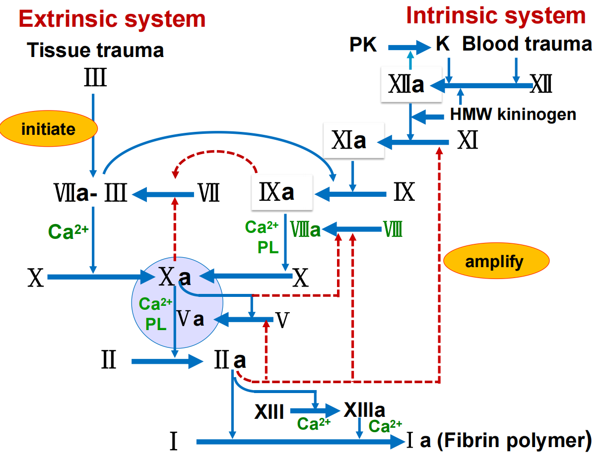
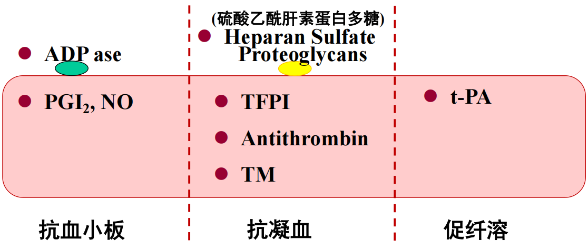

# 凝血抗凝机制与血型
# 生理止血（Hemostasis）

## 3.1 定义与出血时间

* **生理止血（Hemostasis）**：小血管破损后，在**无需外加措施**的情况下，出血可于数分钟内**自行停止**的过程。
* **出血时间（Bleeding time）**：血管破损后，血液自然流出至**停止出血**所用时间；**正常 1–3 min，最大不超过 9 min**。

  * **↑↑**：提示**出血倾向（hemorrhagic tendency）**
  * **↓↓**：提示**血栓（thrombosis）**风险增加。

## 3.2 止血三机制（按时序/功能归纳）

1. **血管收缩（vascular constriction）**

   * 破损部位**反射性收缩**，并释放**5-HT、TXA₂**等缩血管物质 → **血流减慢**有利止血。
2. **血小板血栓（platelet plug）**

   * **黏附→激活→聚集**形成“一期止血（primary hemostasis）”。
3. **凝血（coagulation）与纤维蛋白网**

   * 通过**凝血酶（thrombin）**将**纤维蛋白原（fibrinogen）**转为**纤维蛋白（fibrin）**，并**交联稳定**形成“二期止血（secondary hemostasis）”。

* **血栓（thrombosis）**：当上述反应**过度或位置异常**时形成。

---

# 3.2 血液凝固（Blood Coagulation）

## 3.2.1 基本概念

* **血液凝固**：血液由**流动的液态**转变为**不能流动的凝胶态**的过程。
* **促凝/抗凝平衡**：血液与组织内既有**促凝物质（procoagulants）**也有**抗凝物质（anticoagulants）**；是否凝固取决于双方**动态平衡**。

## 3.2.2 凝血因子（Coagulation Factors）与同义名（节选表）

**定义**：血浆与组织中直接参与血液凝固的物质。

> 注：罗马数字 **I–XIII**（除去“VI”已弃用）+ Ca²⁺（IV）+ **血小板磷脂（PL）** + **前激肽释放酶（PK, Pre-kallikrein）** + **高分子激肽原（HMWK）**。

* **I Fibrinogen（纤维蛋白原）**
  **做啥**：被 **Ⅱa（凝血酶）**剪成纤维蛋白单体→自聚合成纤维；被 **XIIIa** **交联**成稳定网。
  **在哪步**：终末成网与稳定血栓。

* **II Prothrombin（凝血酶原）**
  **做啥**：被**凝血酶原酶**（**Xa–Va–Ca²⁺–PL**）剪→**Ⅱa**。
  **Ⅱa 的大作用**：剪 **I**；正反馈促进 **V、VIII、XI**；活化血小板；+Ca²⁺激活 **XIII**。

* **III Tissue factor, TF（组织凝血活酶/组织因子）**
  **做啥**：外源起点；与 **Ⅶ/Ⅶa** 在 **Ca²⁺/PL** 上组成 **TF–Ⅶa**，主剪 **X→Xa**，旁剪 **IX→IXa**。

* **IV Calcium（Ca²⁺）**
  **做啥**：桥接含 **Gla** 的因子（Ⅱ/Ⅶ/Ⅸ/Ⅹ）到 **PL**；**缺它就不凝**（体外抗凝用枸/草酸盐螯钙）。

* **V Proaccelerin（加速素）**
  **做啥**：**Xa 的辅因子**，与其成**凝血酶原酶**；被 **Ⅱa** 激活/**Xa**剪为 **Va**；被 **APC** 失活。

* **VII SPCA / Proconvertin / Stable factor**
  **做啥**：与 **TF** 成 **TF–Ⅶa**，主剪 **X**，旁剪 **IX**；**Xa、Ⅸa** 可促 **Ⅶ→Ⅶa**（外源自我加强）。

* **VIII Antihemophilic factor A（AHF/AHG）**
  **做啥**：**Ⅸa 的辅因子**，与之成**内源性十酶**；被 **Ⅱa/Xa** 激活为 **Ⅷa**；被 **APC** 失活。

* **IX PTC / 抗血友病因子B**
  **做啥**：被 **XIa** 或 **TF–Ⅶa** 激活为 **Ⅸa**；与 **Ⅷa** 组成**内源性十酶**，剪 **X**，同时还促 **Ⅶ→Ⅶa**。

* **X Stuart factor**
  **做啥**：被 **TF–Ⅶa** 或 **Ⅸa–Ⅷa** 激活为 **Xa**；与 **Va** 组成**凝血酶原酶**。

* **XI PTA / 抗血友病因子C**
  **做啥**：被 **XIIa**（及 Ⅱa 放大）激活为 **XIa**；剪 **IX→Ⅸa**。

* **XII Hageman factor**
  **做啥**：接触激活起点（与 **HMWK/PK** 在负电表面）；**XII→XIIa** 后剪 **XI→XIa**；与 **PK→K（激肽释放酶）**互相放大。

* **XIII Fibrin-stabilizing factor（纤维蛋白稳定因子）**
  **做啥**：被 **Ⅱa** 激活为 **XIIIa**，**交联**纤维蛋白，令血块**稳定/抗溶**。

* **PL Platelet phospholipid（血小板磷脂）**
  **做啥**：**两大复合体的平台**（内源性**十酶**、**凝血酶原酶**）；活化血小板把带负电的 PS 外翻提供 PL。

* **PK / HMWK（接触系统）**
  **做啥**：**HMWK**做“脚手架”把 **PK、XII** 拉到负电表面；**XIIa** 把 **PK→K（激肽释放酶）**，**K 反过来促 XII→XIIa**，形成**互相放大**。

## 3.2.3 瀑布学说与“三步反应”

* **瀑布/级联学说（1964）**：凝血是**因子级联激活**并伴随**放大效应**的过程，最终产生**凝血酶**与**纤维蛋白凝块**。
* **三大步骤**：
  ① **生成凝血酶原酶复合物（prothrombinase complex = Xa + Va + Ca²⁺ + PL）**
  ② **凝血酶原酶催化凝血酶原（II）→ 凝血酶（IIa）**
  ③ **凝血酶（IIa）催化纤维蛋白原（I）→ 纤维蛋白（Ia）→ 纤维蛋白包裹血小板、血细胞和血浆形成凝块**，再由**XIIIa交联稳定**。
* **血凝块（clot）**：**纤维蛋白网**网罗**血细胞、血小板、血浆**，并**黏附血管破口**以**防止继续失血**。

## 3.2.4 内源性与外源性途径（共同汇聚于Xa）

> 图示：Fig.6.1 内/外源性凝血途径

### 总览

* **共同目标**：生成 **Xa** → 组 **凝血酶原酶（Xa–Va–Ca²⁺–PL）** → **Ⅱ→Ⅱa** → **I→Ia（+XIIIa 交联）**。
* **功能分工**：**外源性快，负责“启动”（≈15 s）**；**内源性慢，负责“放大与维持”（1–6 min）**。

### A. 外源性通路（Extrinsic）——**启动器**

**起点**：Tissue trauma → **TF（III）** 暴露
**主通路（必背）**

1. **TF + VII → TF–VIIa（Ca²⁺/PL）**
2. **TF–VIIa** **剪 X → Xa**（蓝实线）
3. **Xa + Va + Ca²⁺ + PL** → **凝血酶原酶** → **II → IIa**

**旁路/交叉**

* **TF–VIIa** **剪 IX → IXa**（去右侧“预热”内源性十酶）

**正反馈**

* **Xa → VII→VIIa**（你图的红虚线回 Ⅶ）
* **Ⅸa → VII→VIIa**（次要加速，图上也画了）

> 关键词：**“3→7→10（兼点9）”**；外源**快**，负责**initiate**。

### B. 内源性通路（Intrinsic）——**扩增器**

**起点**：Blood trauma / **接触胶原/带负电表面**（血小板参与）

**接触系统起动**
0) **HMWK** 把 **PK、XII** 拉到负电表面

1. **XII → XIIa**（接触激活；有 **HMWK/PK** 辅助）
2. **XIIa → PK → K（激肽释放酶）**；**K ↔ XIIa** **互相放大**

**主通路（必背）**
3) **XIIa → XIa**
4) **XIa + Ca²⁺ → Ⅸ → Ⅸa**
5) **Ⅸa + Ⅷa + Ca²⁺ + PL（内源性十酶）** **剪 X → Xa**

* **Ⅷa 从哪来**：**Ⅱa 强力把 Ⅷ→Ⅷa**（同时把 **V→Va、XI→XIa**，并活化血小板→PL↑）

> 关键词：**“12→11→9(+8)→10”**；内源**慢**，负责**amplify**。

### C. 共同终末通路（Common）

* **凝血酶原酶**：**Xa–Va–Ca²⁺–PL** → **Ⅱ→Ⅱa**
* **Ⅱa 的三板斧**：

  1. **I → 纤维蛋白单体 → 聚合**
  2. **XIII → XIIIa**：交联稳定
  3. **正反馈**：↑**V、VIII、XI** + **血小板**（PL↑）

### D. **正反馈“油门”**

* **Ⅱa**：↑**V→Va、VIII→VIIIa、XI→XIa**，活化血小板（PL↑）
* **Xa**：↑**VII→VIIa**
* **Ⅸa**：↑**VII→VIIa**
* **TF–Ⅶa**：旁路点燃**内源性（Ⅸ→Ⅸa）**

## 3.2.5 关键调控：Ca²⁺与维生素K

* **Ca²⁺**：多数反应**必需**；体外可用**枸橼酸/草酸**螯合Ca²⁺以**抗凝**。
* **维生素K**：肝合成**II、VII、IX、X**所**必需**；缺乏可致**严重出血倾向**。

## 3.2.6 凝块回缩与血清

* **凝块回缩（Clot Retraction）**：凝血后1-2h后，凝块**收缩**并释出**黄色清亮液体**即**血清（serum）**。
* **血浆 vs 血清**：血清**缺乏**若干凝血因子（如**I、II、V、VIII、XIII**），且含来源于血小板的**化学物质**。

---

# 3.2.7 抗凝机制（Anticlotting Mechanism）

## A. 内皮相关因素（Endothelial factors）

1. **平滑内皮表面**：避免**接触激活**（内源性起始）。
2. **PGI₂、NO**：抑制**血小板聚集**。
3. **ecto-ADPase（胞膜ADP酶）**：降解ADP，**抑制血小板活化**。
4. **内皮糖萼 HSPG（Heparan sulfate proteoglycans）+ 抗凝血酶（Antithrombin）**：灭活**IIa/Xa**等凝血酶系。
5. **TFPI（组织因子途径抑制物）**：抑制**TF–VIIa–Xa**复合体。
6. **t-PA（组织型纤溶酶原激活物）**：促进**纤维蛋白溶解**。
7. **凝血酶调节蛋白（TM）**：与**凝血酶**结合→**移除凝血酶活性**使凝血过程减慢停止，并**激活蛋白C（Protein C）**，后者与**蛋白S**协同**灭活Va/VIIIa**。

## B. 生理性抗凝物（Plasma inhibitors）

* **丝氨酸蛋白酶抑制物（serpins）**：**抗凝血酶（AT）**、肝素辅助因子II、C1-INH、**α1-抗胰蛋白酶**、**α2-抗纤溶酶（α2-AP）**、**α2-巨球蛋白**等；其中**AT最重要**（由**肝细胞**和**血管内皮细胞**分泌）。
* **AT + 肝素（heparin）**：对**IIa、IXa、Xa、XIa、XIIa**的灭活能力 **↑100–1000倍**。
* **蛋白C系统**：**凝血酶+TM**激活**PC→APC**；**APC + PS**选择性灭活**Va/VIIIa**。
* **TFPI**：与**Xa**结合抑制**TF–VIIa**通路。

> 图示：Fig.6.2 抗凝物质分类

---

# 3.3 纤维蛋白溶解（Fibrinolysis）

## 3.3.1 激活与作用

* **纤溶酶原（plasminogen）→ 纤溶酶（plasmin）**：

  * **t-PA（组织型）**：**血管激活物**，**血管内皮细胞**合成；在**纤维蛋白存在**下与纤溶酶原共同**结合纤维蛋白**，**激活活性↑约1000倍**（定位性强）。
  * **u-PA（尿激酶型）**：**组织激活物**，内皮/巨噬/肾上皮/部分肿瘤细胞表达；**以血管外纤维蛋白溶解为主**（促进细胞迁移、溶解尿中凝块），其次参与血浆纤维蛋白清除。
  * **FXIIa、Kallikrein**：**血浆激活物**，联系**接触系统**，使**凝血与纤溶**协同平衡。
* **抑制物**：**PAI-1**（激活物抑制）、**α2-AP**（纤溶酶抑制）、**TAFI**（凝血酶可激活）。
* **纤溶酶**可降解**纤维蛋白**及部分凝血蛋白（如**I、II、V、VIII、XII**）→ **溶栓**。

---

# 4. 血型与输血（Blood Groups & Transfusion）

## 4.1 ABO 血型系统

* **血型（blood group）**：红细胞膜上的**特异性抗原（凝集原, agglutinogens）**类别。
* **凝集素（agglutinins）**：**抗体（γ-球蛋白）**，由骨髓/淋巴细胞产生；

  * **IgM**：**天然抗体（natural antibody）**，**不**能通过胎盘；五聚体，有**10个结合位点**；
  * **IgG**：**免疫抗体（immune antibody）**，**能**通过胎盘；单体，**2个结合位点**。
* **A1/A2 亚型**：

  * **A1**：A + A1 抗原；**A2**：仅 A 抗原；**A2 个体可能存在抗 A1**。
* 新生儿血浆**出生时几乎无**凝集素；**2–8 个月**开始产生；**8–10 岁**达**最高滴度**，之后逐渐下降。
* **ABO 的生化与遗传基础**

  * ABO 基因编码**糖基转移酶**：

    * **A 型**：向 H 物质末端加 **N-乙酰半乳糖胺**；
    * **B 型**：加 **半乳糖**；
    * **O 型**：转移酶失活（不加糖），保留 **H 物质**。
  * **H 物质**由 **FUT1（α1,2-岩藻糖基转移酶）**合成，是 A/B 抗原表达的底物。
  * **Bombay 表型（Oh）**：**缺失 H 物质**，红细胞无 A/B/H 抗原，血浆常有**抗-H**，只能互相（Oh↔Oh）输血，**不能用普通 O 型**。
* **典型表型与血清抗体**

  * **A（A1）**：红细胞 **A + A1 抗原**；血清 **抗-B**。
  * **A（A2）**：红细胞 **A 抗原**；血清 **抗-B + 抗-A1**。
  * **B**：红细胞 **B 抗原**；血清 **抗-A**。
  * **AB（A1B/A2B）**：红细胞 **A±A1 + B**；血清**无抗-A/抗-B**（A2B**抗-A1**）。
  * **O**：红细胞**无 A/B 抗原（有 H）**；血清 **抗-A + 抗-B**。
* **血清学鉴定**：分别以**抗-A**与**抗-B**标准血清与待检血液混合，观察**凝集反应**判定血型。

## 4.1.2 Rh 血型系统

* **Rh 抗原**：**D、E、C、c、e**；**D 存在即 Rh（+）**；“d”为**沉默基因**。
* **抗体特点**：**无天然抗-D**；**免疫性抗-D 为 IgG**，可**通过胎盘**。
* **人群分布（RhD）**：欧洲人群 Rh- **≈16%**；亚洲人群 Rh- **<1%**；（课件含更细分群体数据）。
* **临床相关**：

  1. **Rh免疫性输血反应**：Rh- 受者输入 Rh+ 血 → 产生抗-D → 再次接触可致**凝集/溶血**。
  2. **新生儿溶血病（Erythroblastosis fetalis）**：**Rh- 母 / Rh+ 胎**；**母体IgG 抗-D经胎盘**导致胎儿**RBC 凝集/吞噬**。

     * **患病概率**：**首胎 Rh+ 多无害**；**第2胎 ≈3%**；**第3胎 ≈10%**。
     * **预防**：**Rh- 孕/产妇**应**及时注射抗-D 免疫球蛋白**。

## 4.2 血容量与输血

* **正常循环血量**：约占体重**8%**（**70–80 ml/kg**）；另有**贮存血量**（肝、肺、腹腔静脉、皮下静脉丛）。
* **失血分级与处理**：

  * **<10%（≤500 ml 成人）**：机体可**代偿**，成分快速恢复。
  * **≈20%（~1000 ml）**：代偿**不足**，需**输血/输液**。
  * **≥30%**：**危及生命**，须**紧急抢救**。
* **交叉配血（Cross-match）**：

  * **大交叉**：供血者**红细胞** × 受血者**血清**（**最关键**）
  * **小交叉**：供血者**血清** × 受血者**红细胞**
* **成分输血策略**：

  * **失血性休克**：优先**全血**；
  * **血浆丢失/血液浓缩（如烧伤）**：**血浆**；
  * **脱水**：**适当电解质溶液**；
  * **白蛋白/高渗液**：通过**渗透回扩**扩容。

---

# 课后作业 & 练习题（来源于课件）

* **作业**

  1. **血浆渗透压**的组成及生理意义
  2. **红细胞的特性**
  3. **红细胞生成（Erythropoiesis）及调节**
  4. **血小板的特性与功能**
  5. 如何维持**凝血–纤溶平衡**？
  6. **小血管损伤后的止血过程**
  7. **何为血型？如何鉴定自身血型？**
  8. **何为交叉配血？**
* **选择/病例题**（四题，按课件原题陈述，未给标准答案）

  1. ABO 判读题（“红细胞与B型血清发生凝集/其血清与B型红细胞不凝集” → 判定血型）
  2. 止血栓**定位**依赖的血小板特性（黏附/聚集/收缩/吸附）
  3. **GPIIb 缺陷**患儿：**出血时间延长**与哪项血小板功能下降相关
  4. **Rh 溶血病**新生儿换血：四个选项中**最佳血液选择**以替换**抗Rh 抗体**。

---

# 高频英文关键词（按主题速查）

**止血与凝血**

* Hemostasis 生理止血；Bleeding time 出血时间；Primary/Secondary hemostasis 一期/二期止血；Platelet plug 血小板血栓；Vasoconstriction 血管收缩；Procoagulant/Anticoagulant 促凝/抗凝；**Prothrombinase complex**（Xa+Va+Ca²⁺+PL）**凝血酶原酶复合物**；**Thrombin** 凝血酶；**Fibrinogen/Fibrin** 纤维蛋白原/纤维蛋白；**Clot** 凝块；**Clot retraction** 凝块回缩；**Serum** 血清。

**凝血因子与途径**

* Coagulation factors I–XIII（同义名详见上文）；**PL** 血小板磷脂；**PK（Prekallikrein）/HMWK**；**Intrinsic/Extrinsic pathway** 内源性/外源性途径；**Tissue factor（TF/III）** 组织因子；**Positive feedback** 正反馈；**Calcium（IV）**；**Vitamin K-dependent factors（II, VII, IX, X）**。

**抗凝与纤溶**

* **PGI₂/NO**；**ecto-ADPase**；**Heparan sulfate proteoglycans（HSPG）**；**Antithrombin（AT）**；**Heparin**；**Thrombomodulin（TM）**；**Protein C（PC）/Protein S（PS）**；**TFPI**；**t-PA/u-PA**；**Kallikrein/FXIIa**；**PAI-1**；**α2-Antiplasmin（α2-AP）**；**TAFI**；**Plasminogen/Plasmin**。

**血型与输血**

* **Agglutinogen（凝集原）/Agglutinin（凝集素）**；**IgM/IgG**（胎盘通透性不同）；**A1/A2**；**Serological test** 血清学鉴定；**Rh（D, E, C, c, e）**；**Rh immune response**；**Erythroblastosis fetalis（新生儿溶血病）**；**Cross-match（Major/Minor）** 大/小交叉配血；**Component transfusion** 成分输血。

