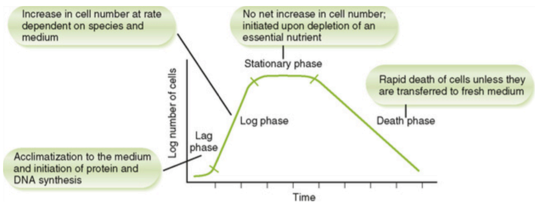

# 细菌生理学

> 章节：Chapter 3 Bacterial Physiology；主讲：Yongmei Li（[liym@tmu.edu.cn](mailto:liym@tmu.edu.cn)）
---

## 一、开放系统 vs 封闭系统（Open System vs Closed System）

* **开放系统（Open System）**
  自然界中的生长环境；营养**持续补充**、代谢废物**被清除**。

  * 关键词：nutrients replenished；wastes removed
* **封闭系统（Closed System）**
  实验室典型条件（如**固体平板**、**液体培养基**）；营养**逐渐耗尽**、废物**不被移除**。

  * 关键词：agar plates；broth tubes
* **临床/科研应用**
  ① **病原学诊断**（从临床标本鉴定致病菌）
  ② **微生物学研究**（性状与性质）
  ③ **生物制品制备**（疫苗、抗原、类毒素 *toxoids* 等）

---

## 二、细菌生长的基本需求（Requirements for Bacterial Growth）

### 1）营养（Nutrients）

* **水（Water）**
* **碳源（Carbon source）**
* **氮源（Nitrogen source）**
* **无机盐（Inorganic salts）**
* **生长因子（Growth factors）**：**细胞必需但自身不能合成**的有机化合物

  * 关键词：organic compounds that a cell must have for growth but cannot synthesize itself

### 2）pH / 氢离子浓度（Hydrogen ion concentration）

* **中性菌（Neutrophile）**：最适 **pH 6.0–8.0**
* **嗜酸菌（Acidophile）**：最适 **pH < 5.5**
* **嗜碱菌（Alkaliphile）**：最适 **pH > 10.5**

### 3）温度（Temperature）

* **嗜冷菌（Psychrophile）**：**20–30 °C**
* **中温菌（Mesophile）**：**30–37 °C**（多临床致病菌）
* **嗜热菌（Thermophile）**：**50–60 °C**

### 4）通气/供氧（Aeration）

* 需根据菌种氧需求设计培养条件（如振荡、通气、厌氧环境等）。

---

## 三、细菌繁殖方式（Mode of Reproduction）

* **二分裂（Binary fission）**：**无性繁殖**，一个细胞分裂为两个子细胞。

---

## 四、生长速度与计算（Prediction of Growth）

* **倍增时间/世代时间（Generation time / Doubling time, *t*d）**
  定义：单个细胞完成一次二分裂所需的时间。

  * **多数**细菌：如 **Escherichia coli**（大肠杆菌）**20–30 min**
  * **特殊**细菌：如 **Mycobacterium tuberculosis**（结核分枝杆菌）**18–20 h**
* **生长速率常数（Growth rate constant, *k*）**
  用于估算指定时间内的生长量或达到指定生长量所需时间。

  * 课上例：**t\*d = 10 min（≈0.17 h）→ *k* ≈ 4.1 h⁻¹**
  * （常用关系式供参考：*k* ≈ 0.693 / *t*d（以小时计）——由例题可验证）

---

## 五、批量培养与典型生长曲线（Batch Culture & Growth Curve）

**定义**：在**固定体积**液体培养基中接种微生物，**定期计数**每 mL 可存活细胞数并作图，得到随时间的生长曲线；该培养属于**批量培养（batch culture）**，是**封闭系统**（资源有限）。

### 四个生长阶段与特征

1. **迟滞期（Lag phase）**

   * **不立即分裂**；细胞**延长**并合成**蛋白质与细胞分裂相关酶**等大分子
   * **增长速率：≈0**
2. **对数期/指数期（Exponential/Log phase）**

   * **恒速分裂**；展现**典型生物学特性**：
     **染色特征（staining）**、**形态（shapes）**、**化学反应（chemical reactions）**、
     **对抗菌药物敏感性（sensitivity to antimicrobial agents）**
   * **增长速率：恒定（最大特异生长速率）**
   * **临床要点**：多数**抑菌/杀菌药**对处于活跃分裂期的细菌更敏感。
3. **稳定期（Stationary phase）**

   * **分裂速率下降**，**总活菌数基本恒定**（出生≈死亡）
   * **出现非典型形态**；可能**产生孢子、外毒素、抗生素**等代谢物
   * **增长速率：≈0**
4. **衰亡期（Death/Decline phase）**

   * **活菌数呈指数下降**；细胞**崩解**或出现**异常形态**
   * **增长速率：负值（死亡）**

---

## 六、异化与同化（Catabolism vs Anabolism）

* **异化（Catabolism）**：分解代谢，**释放能量**与前体代谢物。
* **同化（Anabolism）**：合成代谢，**消耗能量**与还原力，构建**细胞组分/代谢产物**。
* 二者互为**物质与能量**来源/去路，相辅相成。

---

## 七、医学重要的**合成**产物（Medically Important **Anabolic** Products）

1. **致热源（Pyrogen）**：**多糖**类产物，可引起**体温升高**（发热反应）。
2. **毒素（Toxins）**

   * **外毒素（Exotoxin）**：分泌型，**高效应特异**；多为蛋白质。活细胞分泌
   * **内毒素（Endotoxin）**：革兰阴性菌细胞壁**脂多糖（LPS）**成分相关。细菌死亡或裂解时释放
3. **侵袭性酶（Invasive enzyme）**：促进**组织侵袭与扩散**。
4. **抗生素（Antibiotic）**：微生物产物，可**抑制/杀灭**其他微生物。
5. **细菌素（Bacteriocin）**：抑制/杀死**近缘物种或同种不同菌株**的因子。
6. **维生素（Vitamin）**：部分菌可合成并释放。
7. **色素（Pigment）**：具有**鉴别诊断价值**（如产色表型）。

> **医学意义（提示）**：这些产物可影响**致病力**、**临床表现**（如发热、休克）、**实验室诊断**（产色、毒素检测）、**治疗策略**（对数期用药更敏感；稳定期代谢产物增多）等。

---

## 八、课堂要点回顾（Summary）

* **定义**：pyrogen、antibiotic、bacteriocin
* **生长需求**：营养（含生长因子）、pH、温度、**通气**
* **繁殖方式**：**二分裂**
* **生长曲线**：**迟滞—对数—稳定—衰亡**四期及各自特征
* **七类医学重要合成产物**：致热源、（外/内）毒素、侵袭性酶、抗生素、细菌素、维生素、色素

---

## 九、重点英文词汇速查

* Open system／Closed system
* Growth requirements：Water；Carbon source；Nitrogen source；Inorganic salts；**Growth factors**
* **Neutrophile**（pH 6.0–8.0）；**Acidophile**（pH <5.5）；**Alkaliphile**（pH >10.5）
* **Psychrophile**（20–30 °C）；**Mesophile**（30–37 °C）；**Thermophile**（50–60 °C）
* **Aeration**；**Binary fission**
* **Generation time / Doubling time (t\*d)**；**Growth rate constant (k)**
* **Batch culture**；**Growth curve**：**Lag / Exponential (Log) / Stationary / Death (Decline)**
* **Staining**；**Shapes**；**Chemical reactions**；**Sensitivity to antimicrobial agents**
* **Catabolism**；**Anabolism**
* **Pyrogen**；**Exotoxin**；**Endotoxin**；**Invasive enzyme**；**Antibiotic**；**Bacteriocin**；**Vitamin**；**Pigment**

