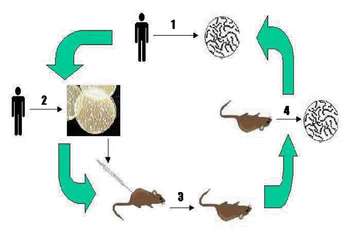
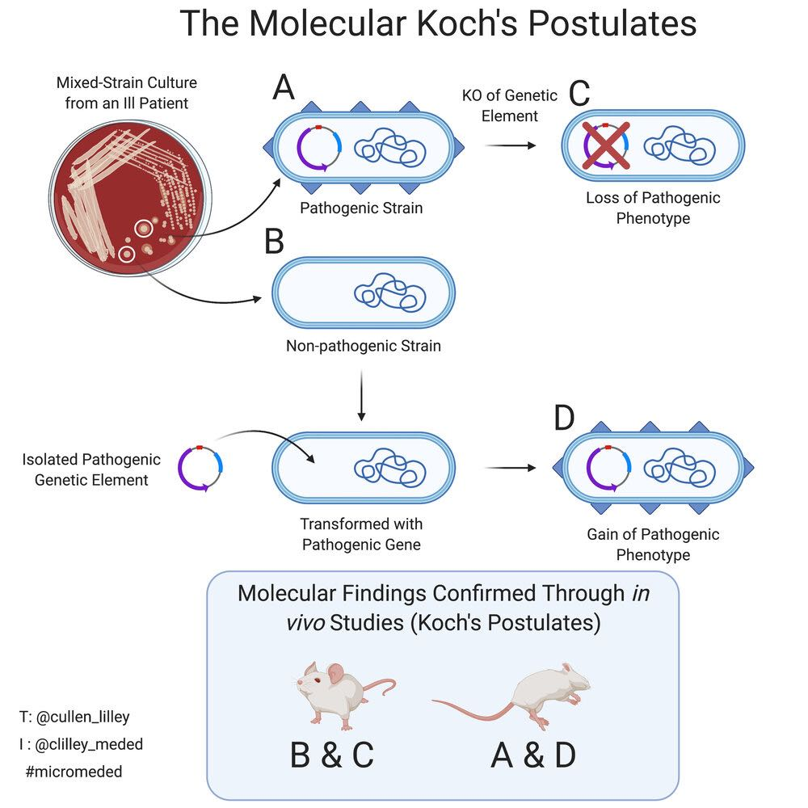

# 感染与发病机制

## 总览（Overview）

**感染性疾病过程 = 病原体（Pathogen）× 环境（Environment）× 宿主（Host）**

* **学习目标**：

  * 感染进程如何启动（initiation of infectious process）
  * 感染如何导致体征与症状（signs & symptoms）
  * 发病机制（pathogenesis）：病原体如何让你生病
* 传染三角（transmission triangle）：

  * **宿主**：是否易感（susceptible）——无既往暴露/无适应性免疫；有创操作；免疫抑制/免疫低下
  * **病原体**：毒力因子（biochemical/structural/genetic factors）、接种量（number of infecting microorganisms）、进入途径（route of entry）
  * **环境**：当季流行病原、针刺伤风险、大量污染事件风险、发热归国旅行者风险等
* 定义：

  * **致病性（pathogenicity）**：病原体能否致病
  * **毒力（virulence）**：致病性的强弱程度

---

## 人体微生物群与微生物组（Human microbiota & microbiome）

* **人体微生物群（microbiota）**：病毒群（virota）、细菌群（bacteriota）、古菌群（archaeaota）、真菌群（mycobiota），健康个体中与宿主**和平共处**，被称为“辅助器官”。
* **人体微生物组（microbiome）**：该群落全部基因与功能的总体，包括：病毒组（virome）、细菌组（bacteriome）、古菌组（archaeome）、真菌组（mycobiome）。
* **医学意义（以细菌群为例）**：

  * **拮抗作用（antagonism）**：竞争宿主细胞受体、竞争营养、产生代谢/毒性产物抑制外来菌
  * **营养功能（nutritional）**
  * **免疫调节（immunity）**
  * **抗衰老（anti-aging）**
* **菌群失衡与疾病（dysbiosis & diseases）**：微生态破坏→多系统疾病风险升高。

---

## 机会致病菌（Opportunistic pathogen）

* **定义**：仅在**免疫抑制**或**体质衰弱**人群中致病的病原体。
* **发生条件**：

  * **易位（translocation）**：菌体突破原生态位屏障
  * **宿主防御下降**：免疫抑制/衰弱
  * **菌群失调（dysbacteriosis）**
* **结果**：机会性感染（opportunistic infection）。

---

## 定植 vs 疾病（Colonization vs Disease）

* **定植（colonization）**：微生物存在但**不干扰**机体正常功能，可短期或长期存在。
* **疾病（disease）**：微生物与宿主相互作用导致**组织损伤**（来自微生物毒力因子和/或宿主免疫反应）。

---

## 科赫法则（Koch’s postulates, 1884）

* 经典判定病原体与疾病因果关系的四条准则（课件提示条目）。

### 经典科赫法则 Koch’s Postulates（1884）

> 图示：Fig.7.1 经典科赫法则示意图

1. **病例必在**（association）
   患者组织中**总能发现**该微生物，健康者**缺乏**。（present in all cases; absent from healthy)

2. **分离纯培养**（isolation & **pure culture**）
   自患者**分离**并在实验室**纯培养**。（isolate; grow in pure culture）

3. **接种复制疾病**（causation / reproduction of disease）
   将纯培养物**接种**到易感健康动物→**出现同样疾病**。（inoculate; reproduce same disease）

4. **再分离同一菌**（re-isolation / recovery）
   自实验动物病灶**再次分离**到**同一**微生物。（re-isolate the same organism）

**局限**（limitations）

* 不能体外培养（unculturable；如某些**病毒 viruses**、**麻风分枝杆菌 M. leprae**、**梅毒螺旋体 T. pallidum**）。
* **无症状携带者**（asymptomatic carriers）。
* **多病原/机会感染**（polymicrobial, opportunistic）。
* **伦理与宿主特异性**（ethics, host specificity）。
* **微生物群影响**（microbiome context）。

### 分子科赫法则 Molecular Koch’s Postulates（Falkow）

> 图示：Fig.7.2 分子科赫法则示意图

**目的**：把“致病性”落实到**具体基因/因子**（virulence **gene/factor**）。

A **致病株有该基因**（association with virulence）

* 病原株携带/表达该基因（pathogenic strain has/expresses the gene）。

C **敲除→失去致病表型**（**KO**/**LOF** → loss of pathogenic phenotype）

* 基因**敲除/失活**后，毒力下降或丧失。（gene knockout → reduced virulence）

D **补回/转入→获得或恢复致病表型**（**complementation**/**GOF**）

* 给非致病株**导入**或给敲除株**补回**该基因→**获得/恢复**毒力。（gain/restore phenotype）

B **非致病对照株**（non-pathogenic control）

* 本来不含该基因→不致病。

**动物验证**（in **vivo** confirmation）

* 将上述分子证据在动物模型中**复现**（A&D、B&C组对照）。

**关键词**：virulence factor、pathogenicity island（PAI）、isogenic mutant、transformation/plasmid、expression **in vivo**、host response。

**局限**

* **多基因冗余**（redundancy；敲一个仍致病）。
* **表达依赖环境/宿主**（context-dependent expression）。
* **基因转移**（horizontal gene transfer）。
* **模型外推性**（model-to-human translation）。

---

## 感染发生链（Chain of Infection）与传播方式（Mode of Transmission）

* **感染链要素**：

  * **病原体（Pathogen）**
  * **储存宿主/储存所（Reservoir）**：适于微生物繁衍的场所/宿主
  * **排出门户（Portal of Exit）**：病原体离开储存所的途径
  * **传播方式（Mode of Transmission）**：微生物从一处到另一处的方式
  * **进入门户（Portal of Entry）**：进入新宿主的开口
  * **易感宿主（Susceptible Host）**
* **进入途径**：呼吸道、消化道（alimentary, GI）、皮肤/黏膜、泌尿生殖道、血液等。
* **传播类型**：

  * **水平传播（horizontal）**：直接宿主-宿主或间接接触
  * **垂直传播（vertical）**：经胎盘、产道、母乳自上代至下一代

---

## 感染进入人体后的关键事件

1. **定植与黏附（colonization & adhesion）**
2. **在局部位点增殖与扩散（multiplying & spread）**：经组织直接扩散、淋巴系统或血流播散
3. **逃避免疫（escape from host immunity）**
4. **效应分子/毒素（effectors, toxins）**介导组织损伤

* **结局形态**：

  * **毒性（toxicity）**：局部或全身作用
  * **侵袭性（invasiveness）**：在原位与远处进一步生长

---

## 一、细菌致病机制（Bacterial pathogenesis）

### 1. 黏附、侵袭与吞噬逃逸

* **黏附因子（adherence factors）**：

  * **菌毛（pili）**
  * **细胞壁成分**：脂磷壁酸（LTA）、M蛋白（M protein）
* **侵袭性（invasiveness）结构/分子**：

  * **荚膜/黏液层（capsule/slime layer）**
  * **侵袭酶（invasive enzymes）**
  * **侵袭素（invasins）**
  * **生物被膜（bacterial biofilm）**
* **吞噬作用相关逃逸**：

  * **抑制溶酶体融合**：结核分枝杆菌（M. tuberculosis）
  * **抑制吞噬**：肺炎链球菌荚膜（S. pneumoniae capsule）
  * **逃逸溶酶体并在胞质内生长**：伤寒沙门菌Vi抗原（S. Typhi Vi antigen）等

### 2. 致病产物与组织破坏

* **代谢副产物**：发酵**酸**、**气体**致组织损伤
* **组织破坏性酶**：透明质酸酶（hyaluronidase）、DNA酶（DNAases）、胶原酶（collagenase）等

### 3. 细菌毒素

#### 3.1 外毒素（exotoxin）

* **功能分类**：

  * **神经毒素（neurotoxin）**：影响神经-肌肉传导
  * **肠毒素（enterotoxin）**：引起上皮细胞**过度激活**
  * **细胞裂解毒素（cytolytic toxin）**：导致细胞溶解/抑制蛋白合成
* **结构特点**：常见**AB型**——**A亚基**负责毒性活性，**B亚基**介导黏附与进入

#### 3.2 内毒素（endotoxin）

* **本质**：革兰阴性菌LPS的**脂质A（lipid A）**部分
* **受体与效应**：结合**CD14**与**TLR4**（单核-巨噬细胞、B细胞等）→诱导**急性期细胞因子（acute-phase cytokins）**释放

#### 3.3 外毒素 vs 内毒素（要点对比）

| 维度     | 外毒素（Exotoxin）           | 内毒素（Endotoxin）      |
| -------- | ---------------------------- | ------------------------ |
| 来源     | 革兰阳/阴**活菌**分泌蛋白      | 革兰阴性菌**裂解时释放**LPS的脂质A     |
| 化学性质 | 多肽                       | 脂多糖成分               |
| 热稳定性 | 多**不耐热**（可被加热灭活） | **耐热**                 |
| 抗原性   | 抗原性强，可制**类毒素**     | 抗原性弱，不易制成疫苗   |
| 致病机制 | **高毒性**且有组织特异性（细胞上特异性结合位点）| **中等毒性**没有组织特异性 |
| 遗传性   | 编码于**染色体外基因**(如质粒)         | 编码于**染色体基因**       |

### 4. 免疫致病（Immunopathogenesis）

* **有限且受控**：产生保护性抗菌反应（发热、全身不适）
* **系统性失控**：脓毒症、脑膜炎等**危及生命**表现
* **自身免疫反应（Autoimmune responses）**：

  * 化脓性链球菌**M蛋白**与心肌组织**抗原相似**→**风湿热**（交叉反应）
  * 免疫复合物沉积于肾小球→**链球菌后肾小球肾炎**

---

## 二、真菌致病机制（Fungal pathogenesis）

### 1. 基本概念

* **真菌病/霉菌病（mycoses）**：由酵母/霉菌引起的疾病，**常被漏诊/误诊**。
* **毒力因子**：热二态性（thermal dimorphism）、真菌毒素（toxin production）、**荚膜与黏附因子**、**水解酶**、**炎症刺激物**等。

### 2. 临床表现三大类

1. **真菌感染（fungal infections, 最常见）**：

   * **浅表感染**（皮肤/黏膜）：皮表污染/表浅侵袭
   * **皮下感染**：皮肤外伤接种
   * **系统性感染**：

     * 多为**二态性**真菌；
     * **呼吸道吸入**孢子获得；
     * **地理限布**（受气候/土壤影响）；
     * 可感染**免疫正常**宿主；
     * **疾病表型类似结核**（TB-like）。
2. **真菌中毒（toxicoses / mycotoxins）**：多由**摄入**产生；食用**有毒蘑菇**可致急性中毒。
3. **真菌过敏（allergies）**：多由**吸入/摄入**真菌孢子导致。

### 3. 侵袭性真菌感染的发病流程（典型6步）

1. 吸入**孢子/分生孢子（spores/conidia）**；
2. 进入**肺泡**；
3. 激活**第一道防线**（先天免疫）；
4. 吞噬细胞**耗竭**→肺结节/肺炎进展；
5. 巨噬细胞**吞噬或肉芽肿**包裹；
6. 真菌**寄生于巨噬细胞**并随血流播散，甚至跨越**血脑屏障**→系统性侵犯。

---

## 三、病毒致病机制（Viral pathogenesis）

### 1. 细胞层面（Cytopathogenesis / CPE）

* **进入细胞**→**初次复制与扩散**→**二次复制与组织损伤**
* **致病类型**：

  * **细胞裂解型（cytocidal, cytolytic）**
  * **非裂解型（non-cytolytic, productive）**
  * **中止性感染（abortive）**：不产生完整病毒
  * **非产毒性感染（non-productive）**：**潜伏（latent）**或**细胞转化（transformation）**
* **典型CPE**：

  * 抑制宿主**大分子合成**
  * 诱导**凋亡（apoptosis）**
  * **细胞融合（syncytia）**
  * **病毒抗原插入**细胞膜
  * **包涵体（inclusion body）**形成

### 2. 宿主层面（Host level）

* **体液免疫（humoral）**：对**细胞外**病毒
* **细胞免疫（cell-mediated）**：对**细胞内**病毒
* **病毒诱导的免疫病理**：

  * **抗体介导**：Ag-Ab复合物沉积、**ADE（抗体依赖性增强）**
  * **细胞介导**：T细胞/炎症损伤
  * **免疫抑制**与**自身免疫**
  * **炎症细胞因子**的病理效应
* **免疫逃逸（immune escape）**：

  * **抗原变异（antigenic variation）**
  * **细胞间传播（intercellular transmission）**
  * **抑制免疫反应（inhibit immune response）** 等

---

## 感染的类型与临床分类（Effects/Classification of infections）

### 1. 感染来源

* **外源性感染（exogenous）**：

  * **社区感染（community infection）**
  * **医院感染（hospital infection）**：

    * **院内（nosocomial）**：可为外源或内源交叉感染
    * **医源（iatrogenic）**：医疗操作诱发
  * **传染源**：**患者（patients）**、**携带者（carriers）**（无症状但可传播）、**感染动物/中间宿主**
* **内源性感染（endogenous）**：自体菌群移位致病

### 2. 临床表型

* **隐性感染（inapparent/subclinical）**：有感染但**无可识别**临床体征/症状
* **显性感染（apparent）**：病原繁殖→**出现症状**
* **炎症与播散**：

  * **局部/表浅感染（local/surface）**
  * **系统/播散性感染（systemic/generalized）**：

    * 经**血/淋巴**播散
    * 经**自然通道**（如**神经**）播散

### 3. 细菌显性感染的分型

* **按病程与严重度**：急性（短潜伏、骤起、病程短）、亚急性、慢性、潜伏
* **按部位/性质**：局部感染、系统感染
* **血行相关术语**：

  * **菌血症（bacteremia）**：血中有**细菌存在**，**不繁殖**；常源自化脓灶
  * **败血症（septicemia）**：细菌及其毒素在血中**循环并繁殖**
  * **毒血症（toxemia）**：**外毒素**进入血液
  * **内毒素血症（endotoxemia）**：**内毒素**进入血液
  * **脓毒血症/脓毒败血症（pyaemia）**：**脓毒性栓子**滞留多器官→多发性**小脓肿**

### 4. 病毒显性感染的分型

* **急性（acute）**

| 特征 (Features)                                        | 局部感染 Local infection               | 全身感染 Systemic infection      |
| ------------------------------------------------------ | -------------------------------------- | -------------------------------- |
| **例子 Example**                                       | 呼吸道感染（鼻病毒 Rhinovirus）        | 麻疹 Measles                     |
| **病理部位 Site of pathology**                         | 入口部位（Portal of entry）            | 远隔部位（Distant site）         |
| **潜伏期 Incubation period**                           | 相对较短 Relatively short              | 相对较长 Relatively long         |
| **血症 Viremia**                                       | 无 Absent                              | 有 Present                       |
| **免疫持续时间 Duration of immunity**                  | 可变，可能较短 Variable – may be short | 通常终身 Usually lifelong        |
| **分泌型IgA在抵抗中的作用 Role of sIgA in resistance** | 通常很重要 Usually important           | 通常不重要 Usually not important |

* **持续性感染（persistent infection）**：

  * **潜伏感染（latent）**：病毒以“隐藏形式”长期存在，不产生具有传染性的病毒；特定条件下**激活复燃**
  * **慢性感染（chronic）**：急性感染后**未清除**，**间歇性复制与排毒**，可长期**低水平**检测到
  * **慢病毒/迟发感染（slow virus / delayed）**：**潜伏期长（月-年）**，起初**无症状**，后出现**慢性、进行性、最终常致命**的疾病

---

## 微生物学×临床：三重学习路径（A threefold approach）

1. **诊断**：何以判定“某人已感染”（presumptive/definitive diagnosis 的依据）
2. **传播**：何处/何途径感染（where & how）
3. **治疗与预防**：感染后能做什么（药物/隔离/疫苗/公共卫生）

### 与临床对接的关键问题（Key questions）

* 给定某**病原体**：最可能的**临床表现**是什么？其**相关特征**（细胞壁/基因组等）？最可能的**传播媒介/途径**？最可能的**培养/实验室**发现？
* 给定某**临床症状**或**检查所见**：最可能的**病原**与**机制**是什么（临床或亚临床所见如何产生）？

---

## 重点英文术语与速记（Key Terms）

* **pathogenicity** 致病性；**virulence** 毒力
* **microbiota / microbiome** 微生物群 / 微生物组；**dysbiosis** 菌群失衡
* **opportunistic pathogen / infection** 机会致病菌 / 机会性感染
* **colonization** 定植；**disease** 疾病
* **reservoir** 储存宿主/储存所；**portal of entry/exit** 进入/排出门户
* **mode of transmission** 传播方式；**horizontal/vertical transmission** 水平/垂直传播
* **adhesion factors** 黏附因子；**pili** 菌毛；**LTA** 脂磷壁酸；**M protein** M蛋白
* **capsule / slime layer** 荚膜/黏液层；**biofilm** 生物被膜；**invasins** 侵袭素
* **hyaluronidase / DNases / collagenase** 透明质酸酶/ DNA酶/ 胶原酶
* **exotoxin / endotoxin** 外毒素/内毒素；**lipid A** 脂质A
* **CD14 / TLR4** 模式识别受体；**acute-phase cytokines** 急性期细胞因子
* **AB toxin** AB型毒素（A=活性，B=结合/进入）
* **immunopathogenesis** 免疫致病；**sepsis** 脓毒症；**meningitis** 脑膜炎
* **molecular mimicry** 分子模拟；**rheumatic fever** 风湿热；**poststreptococcal glomerulonephritis** 链球菌后肾小球肾炎
* **mycoses** 真菌病；**thermal dimorphism** 热二态性；**conidia/spores** 分生孢子/孢子
* **superficial / subcutaneous / systemic** 浅表/皮下/系统性
* **CPE (cytopathic effect)** 细胞病变效应；**apoptosis** 凋亡；**syncytia** 合胞体
* **inclusion body** 包涵体；**abortive / productive / latent / transformation** 中止/产毒/潜伏/转化
* **humoral / cell-mediated immunity** 体液/细胞免疫
* **ADE** 抗体依赖性增强；**antigenic variation** 抗原变异；**intercellular transmission** 细胞间传播
* **exogenous / endogenous infection** 外源/内源感染
* **nosocomial / iatrogenic** 院内/医源性感染；**carriers** 携带者
* **local / systemic infection** 局部/系统感染；**bacteremia / septicemia** 菌血症/败血症
* **toxemia / endotoxemia** 毒血症/内毒素血症；**pyaemia** 脓毒血症
* **acute / subacute / chronic / latent infection** 急性/亚急性/慢性/潜伏感染
* **persistent infection** 持续性感染；**slow virus infection** 慢病毒/迟发性感染

---

